# 暴论：怎样才是好的 AI 办公应用

> 现在看到 AI 味太重的文档，都不愿意往下看。

怎样才是一个好的 AI 办公应用？ AI 发展到极致，是会带来共产主义的乌托邦；还是资本加速垄断，变成刘慈欣小说《赡养人类》中的世界，全球财富汇聚于一人？

## 市面产品

先来看一下现在市面上眼熟的 AI 办公应用

| 产品 | 厂商 | 特点 |
|-|-|-|
| Claude Code | Anthropic | 运行复杂任务的标杆。 |
| Codex | OpenAI | 运行复杂任务的标杆。 |
| WorkBuddy | 腾讯 | 腾讯系的产品, 产品设计上有一股互联网老登味。密密麻麻地列了很多互联网时代产品抢入口的东西， 首页复杂得让人都不愿意看。  <br/>也正因为如此降低了很多人在 AI 办公的上手门槛。  |
| TraeWork | 字节 | 类似 WorkBuddy 的产品，但设计上 AI 感更强一些。 |
| QoderWork | 阿里 | 略 |
| 豆包 | 字节 | 具备一定办公能力的 chat 产品。 |

我自己会用这些办公产品么？

- Claude Code & Codex: 当然会用，作为当前最顶层的产品，他们的问题是贵；
- WorkBuddy、QoderWork、TraeWork: 会用的，只要下面接的模型能力足够，就会使用。 
- 豆包: 豆包很好地打通了 Lark， 我会拿它来做咨询/检索，但不会拿豆包做复杂任务。

## 为什么程序员最先把 AI 用起来

为什么大家印象里，都是程序员在使用 AI 写代码，却很少听说其他岗位大规模使用 AI 办公？

写代码比内容运营、标书、小说和绘画等工作的链路更复杂，需要的上下文更多，对错误的容忍度也更低。但程序员天然离 AI 更近，也更愿意尝试新工具，所以更早摸索出了把 AI 用于实际生产的办法。这并不意味着其他行业没有提效空间，只是不同行业面对 AI 时，处在不同阶段：

- **主动采用：**程序员、短剧制作等岗位已经找到了相对完整的使用链路，AI 带来的收益明确，结果也比较容易验证。
- **防御性接触：**插画、小说等创作行业并非不能使用 AI，但因为职业替代和效率红利的分配问题；在积极抵制 AI ,好让分配问题被解决前，AI 能晚几年进入行业。
- **被动采用：**大量传统办公岗位都有需求，但工作上下文散落在消息、文档、表格、业务系统和线下沟通中，没有找到大量使用 AI 办公的可实践方案。

程序员只是最早跑通使用链路的人，并不是唯一会被 AI 改造的职业。

## 用户故事

只看几个典型岗位会如何使用 AI 办公应用，以及产品可能还缺少哪些能力。

### 内容运营

#### **用户会说的话**

> 根据 `新品推广需求.docx` 和品牌资料，帮我写10篇小红书、5篇微博引流文案。先让我审核，通过后从下周一开始每天12点和20点发布，发布24小时后汇总数据给我。

#### **Agent 本地编排流程**

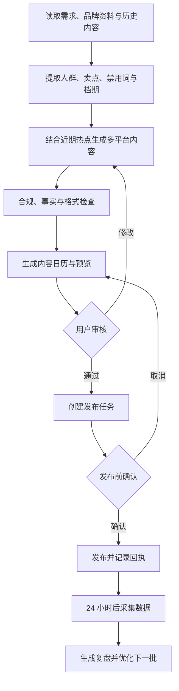

#### **特化需求**

- 品牌语气和禁用词库要能长期记忆，不必每次重复交代。
- 平台差异化改写（小红书口语化、微博话题化）。
- 定时发布 + 发布回执 + 失败重试。
- 人工接管：遇到验证码、风控、账号异常时能停下来等待人工处理。
- 内容合规和事实校验，避免虚假宣传。
- 本地文件读写、知识库

### 管理人员

#### 用户会说的话

> 每个工作日早上9点，把销售、项目进度、客户投诉和费用数据汇总成一页经营摘要。销售额下降超过10%或有重大项目延期时，单独提醒我。

#### Agent 本地编排流程

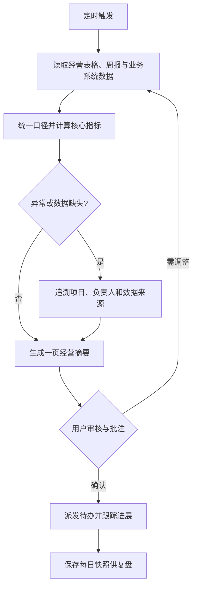

#### 特化需求

- 多来源数据自动对齐口径。
- 明确区分“事实 / 推断 / 建议”，不把相关性写成因果。
- 阈值触发的主动提醒。
- 一页纸摘要 + 可下钻明细。
- 数据来源可追溯、可审计。
- 内网数据读取 (邮件、周报、销售报表)

### 人力资源（招聘）

#### 用户会说的话

> 把今天收到的简历按 `高级运营岗JD.docx` 整理一下，提取相关经验生成候选人对比表和面试建议。不要自动淘汰任何人，先让我审核。

#### Agent 本地编排流程

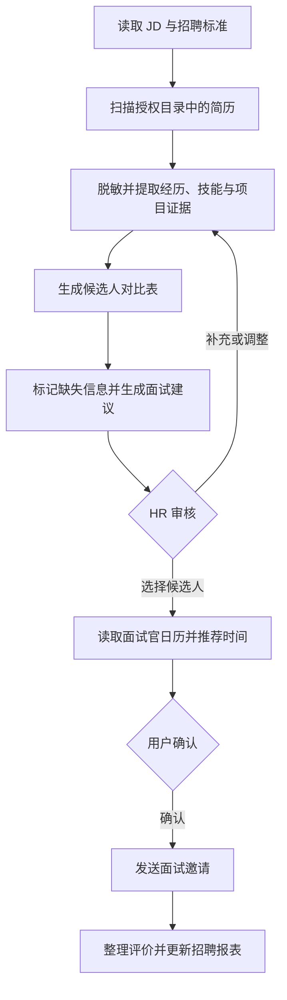

#### 特化需求

- 敏感信息脱敏，降低偏见和合规风险。
- 只做整理和辅助，不自动淘汰或录用。
- 结论必须给出原文依据，可回溯到简历。
- 与日历、邮件连接，安排面试。
- 候选人数据本地隔离，防止外泄。
- 内部数据获取。

### 我自己

#### 用户会说的话

> 基于 Meego 工作项 xxx 及其关联 PRD，读取相关飞书文档和群聊上下文，帮我完成这个需求。先梳理需求、影响范围和实现方案，有不明确的地方先问我。方案确认后再修改代码，完成静态检查并展示 diff。不要自动提交代码或部署，等我确认后再创建 MR、关联 Meego 并部署到 PPE 验证。

#### Agent 本地编排流程

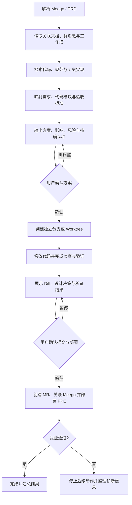

#### 特化需求

- 内部上下文接入：能够读取飞书文档、群消息、Meego/BITS 需求和代码仓库。
- 来源可追溯：每项实现应对应具体 PRD 条目或验收标准，避免凭空补需求。
- 分阶段审批：技术方案、代码 Diff、提交 MR、部署 PPE 分别设置人工确认点。
- 本地安全执行：在独立分支或 Worktree 中修改，限制可访问目录和命令权限。
- 研发工具编排：串联 Lark CLI、bytedcli、Git、Codebase、构建工具和部署平台。

## 办公应用应该具备的功能

看完上面的用户故事，AI 办公应用需要的功能其实不难归类。

| 核心痛点 | 用户实际感受 | 为什么 Chat 产品解决不了 | 对应能力 |
|-|-|-|-|
| **上下文找不全** | 每次都要把文件、聊天记录、业务背景重新喂一遍 | 工作信息散落在消息、文档、表格、代码和内部系统中 | 企业数据连接、历史会话检索、长期记忆 |
| **只能给建议，不能把事情做完** | AI 写完内容后，发布、建任务、发邮件、改 excel 仍要自己完成 | 缺少文件、账号、业务系统和本地环境的操作权限 | 本地执行环境、私有 Skill、office Cli |
| **跨系统流程太长** | 一项工作涉及多个软件或内部网站，反复复制粘贴、核对状态 | 单个 Tool 只能完成局部动作，不能可靠编排完整流程 | Skill、定时与事件触发、企业 Agent 生态(企业 CLI) |
| **AI 不理解 “什么时候该来找我”** | 要么什么都不提醒，要么通知泛滥 | 缺少重要性、相关性、新增性和可行动性的判断 | 主动式助理、用户反馈降噪 |

### 功能全景

按成熟度来分，粗成三层：办公 Agent 的基础门槛、市面上已经有但还没做完整的能力，以及稀缺壁垒的能力。

#### 基础门槛：没有这些，就还只是个 Chat 产品

> Chat 作为办公 AI 应用的过渡性阶段已经过去了，Chat 产品在办公领域上，很快会被能直接操作用户电脑的 AI 应用淘汰。

| 功能模块 | 要解决的问题 | 市面现状 |
|-|-|-|
| **本地执行环境** | 读写本地文件，操作 Office、CLI、浏览器和桌面软件。能走接口就走接口，实在没有接口再让 GUI Agent 兜底。 | 大多数 AI 应用都能发挥客户端优势操作好用户的本地电脑，但对 Office 三件套的支持程度有所差异。  <br/>不能方便操作**用户上班所用电脑**的 AI 应用敢说自己是面向办公，那是自取其辱！ |
| **企业数据连接器** | 接入飞书、钉钉、Microsoft 365、Google Workspace 等用户真正工作的地方。 | AI 真正需要的是账号托管，不应只满足于连接器！  <br/>现在不少厂商对能力完全暴露给 AI 有所顾忌，在当前环境下通过连接器暴露 openAPI 成了妥协后的选择。 |
| **定时任务与事件触发** | 按时间、消息、邮件、文件变化或指标异常自动启动任务。 | 不少产品能定时执行，但事件触发、失败恢复和长期稳定运行还不够成熟。 |
| **权限、审批与审计** | 外发消息、删除文件、提交代码、付款、部署等高风险操作必须让用户确认，并保留完整执行记录。 | 这是办公 Agent 的安全底座，但很多产品仍然把它当成执行后的补充功能。 |

#### 已经有了，但还没有真正做好

| 功能模块 | 要解决的问题 | 市面现状 |
|-|-|-|
| **Skill 市场** | 把垂直岗位和业务流程里的最佳实践沉淀下来，让普通用户不用从零教 Agent 做事。 | 大家都在做，但 Skill 的质量、复用方式和商业模式都还没有跑通。 |
| **长期记忆** | 记住品牌语气、报表口径、代码规范、常用联系人和审批习惯。 | 已经成为标配方向，但效果一言难尽，很容易带来 Context 腐化的问题，实验效果很容易负向。 |
| **团队协作(分享 Session、Fork Session、项目空间共享)** | 分享 Session、fork session，团队/工作空间级别的共享，支持工作交接，而不是每个人都从头聊一遍。 | 市面产品仍以个人使用为主。 |

#### 稀缺壁垒的能力

| 功能模块 | 要解决的问题 | 市面现状 |
|-|-|-|
| **企业 Agent 能力生态** | 以用户身份安全操作企业内部的 OA、ERP、研发和业务系统，而不只是读取几个 SaaS 应用。 | 多数产品缺少完整方案，需要企业 CLI、Tool SDK、私有 Skill 和 FDE 一起建设。  <br/>该部分探索出来后，会对其他 AI 应用形成使用上的护城河。 |
| **多设备 Agent 执行网络** | 手机、PC 和云端可以互相派活，让具备本地文件、登录态或特定 Skill 的设备执行任务。 | 没有稳定的产品形态。都是些龙虾、跨应用操作 codex , trae 移动端操作电脑等比较初阶的形态。 |
| **多端上下文与来源感知** | 不同设备可以继续同一个会话，同时知道消息、工具调用和产物来自哪台设备，不能把所有上下文粗暴混在一起。 | 多数产品只做到了消息同步，还没有真正解决设备环境不同的问题。 |
| **主动式 / 预测式助理** | 让 AI 更像一个真人助理，在低打扰的前提下安排好自己的事项、对重要事项做出提醒。 | 部分产品都尝试过，但普遍败在噪音太大。能做到准而少，才会真正像一个助理。 |
| **历史会话检索** | AI 应用长期用于办公，会积累大量高价值的上下文。搜索会话历史成了刚需，要既能像搜索聊天记录一样手动查，也能让 AI 回答问题，并且可以跳回原始消息和执行记录。 | 大家都在做长期记忆，但易用的历史会话搜索反而很少。飞书知识问答算一个。 |

### 基础门槛：本地执行环境

操作本地电脑不是壁垒，是刚需, 不是壁垒！！！ 不能方便操作用户本地电脑 & 读写 Office 三件套的 Agent，还敢说自己是面向办公的 Agent, 那是自取其辱！！！

本地电脑必备如下能力:

- 读写磁盘
- Office CLI, 一定要具备读写 Office 三件套的能力，市面上主流的公司办公绕不开 Office 三件套。
- GUI Computer Use 兜底，直接操作浏览器，或者是对一些不具备接口的软件，进行基于图形界面的操作。

### 值得展开的壁垒

下面只展开那些真正有机会形成办公壁垒的能力。连接器、定时任务、Skill 市场当然重要，但这些能力大家迟早都会有；真正难的是进入企业内部、跨设备完成任务、把长期上下文留住，以及主动找到用户又不把人烦死。

#### 多设备 Agent 执行网络

> 用户操作手机: 我快要死了，赶紧删除掉我电脑上的浏览器访问记录。

远端执行这个需求现在越来越常见，像什么“理想眼镜操作 Codex”、“让剑平的 SU7 Pro 排查 case”、“我快要死了，赶紧删除掉我电脑上的浏览器访问记录。”等；这些功能应该直接做在 AI 办公应用内部。


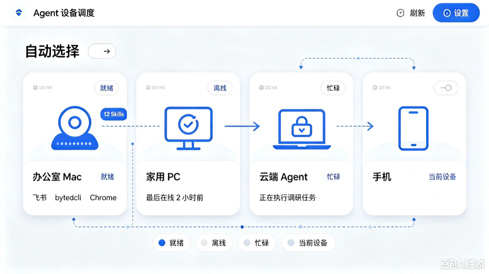

具备以下能力:

- 展示手机、PC、云端 Agent 在线状态
- 远端派活，手机向 PC 发任务，PC 流式返回结果和操作过程。
- 会话同步，多端共享逻辑会话的上下文，能感知到端上设备差异； 每个端的 Skill 是不同的，不能直接粗暴地把远端消息当作本设备上下文。

##### 流程设计

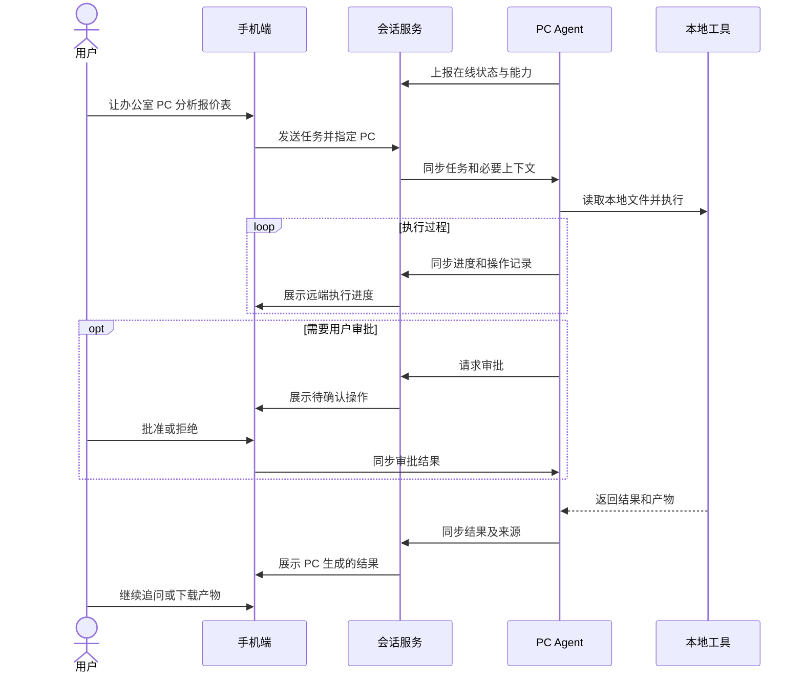

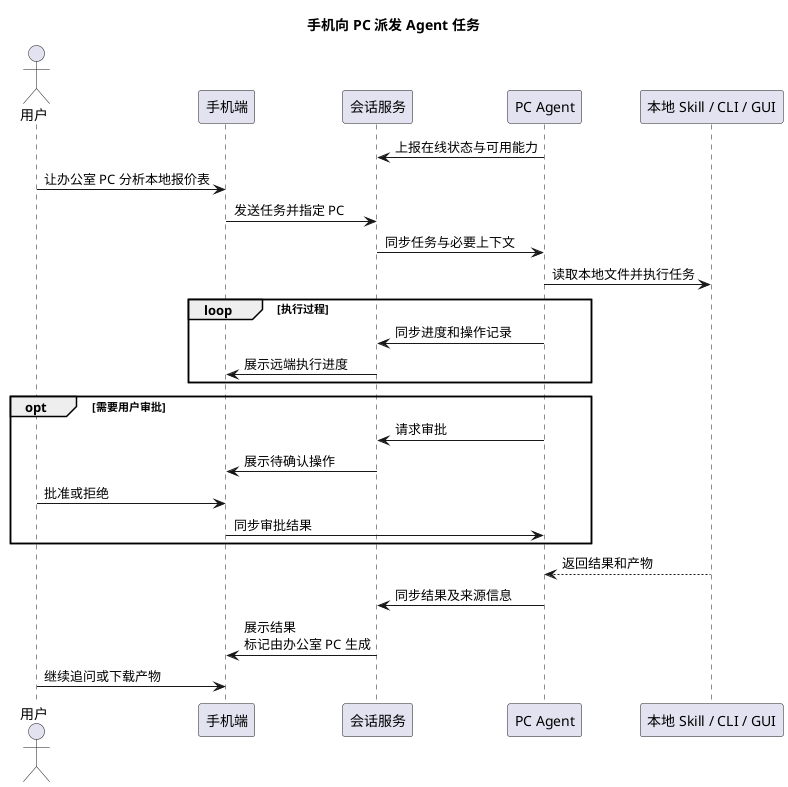

##### Context 设计

多设备执行的 Context 需要划分为两层。设备 Context 是否同步应该可以选择，没有必要把所有 Context 都同步到远端：

- Session Context：逻辑会话维度的 Context，用于所有设备共享和展示会话消息。站在模型视角上，是类似于群聊的上下文， 每个设备是群聊中的一个独立用户；远端设备不被@不响应消息。
- Device Context：每台设备独有的文件、应用状态、登录态、屏幕状态、CLI 环境、Skill 等。与 multi-agent 架构类似，Device Context 没必要同步到远端。

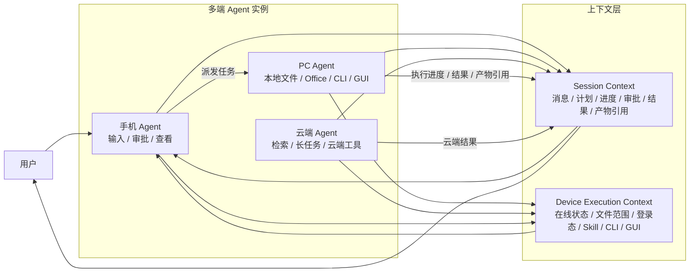

#### 主动式/预测式助理

> AI 持续观察用户授权范围内的信息，只在发现与用户明确相关、重要且可信的事情时主动提醒，让真正值得关注的事情主动找到正确的人。
> 
> 主动推送的内容要准且少，低打扰。哪个助理会拿着无足轻重的事情去打扰自己老板？


##### 用户故事

主动式的 AI 助理，在不少的产品里都有过尝试。

《置身钉内》里提到的钉钉 ONE。它主打 AI「主动服务 / 事找人」，把消息、待办、日程、会议、审批等整理并排序成卡片，主动呈现给用户； 最终收获了很多吐槽。

飞书 GTM 助手也曾做过类似的探索，总结销售的商机，对重要事项推送任务+任务跟踪；被用户吐槽打扰太严重，毁掉了用户的飞书任务。

虽然两者的探索都失败了，但这个用户需求并没有因此而消失。这种主动/预测式询问的能力，如果能做得准确、低噪，AI 才会更像一个真正的助理，更有真人感，也更容易带来惊喜。比如我让豆包写了较多的巴威与海鸟分析的文档，那在白海豚登陆之初，AI 就主动给我推送了我真正会感兴趣的内容/任务。

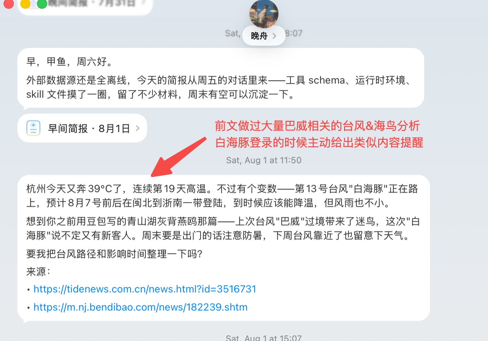

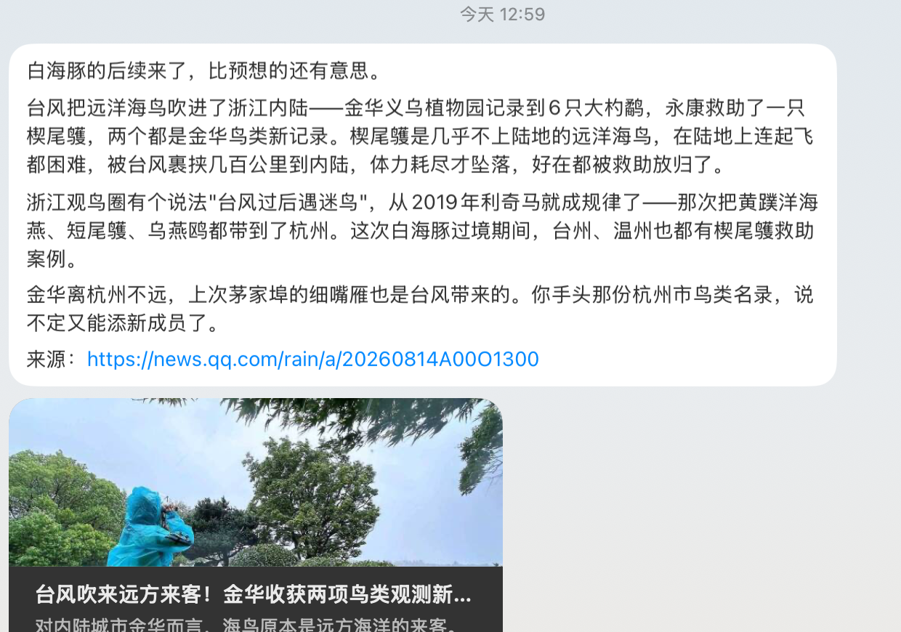

##### 场景 & 低噪音

重要的是找出用户不得不做且有可能遗漏的事情，比如以下场景

- 你负责的服务昨晚错误率明显上涨。
- 你负责的客户出现了较明确的商机信号。
- 群聊中出现了明确需要你处理的重要事项。主动推送必须要低噪音，哪个助理敢有事没事就去烦自己的老板？一条信息只有同时满足以下条件，才应主动提醒：

1. 明确相关：能够解释为什么这件事应该找当前用户。
2. 足够重要：可能影响用户当前工作、客户、收入、进度或系统稳定性。
3. 证据充分：有可靠的数据、消息或文档变化作为依据。
4. 信息新增：用户尚未看到或处理，不重复提醒已知事项。
5. 可以行动：用户看到后能够采取明确行动。不满足条件的信息不推送，可以继续静默观察。

##### 流程设计

主动式提醒的助理式 AI 一定要有，但历史的失败经验告诉我们一定要准确且低打扰；每天只挑若干项最重要的事情发送给用户，也不要尝试给用户创建 Todo / 定时任务等画蛇添足的事情；如果用户真的需要的话，用户在看到提醒后会主动告诉 AI 的。

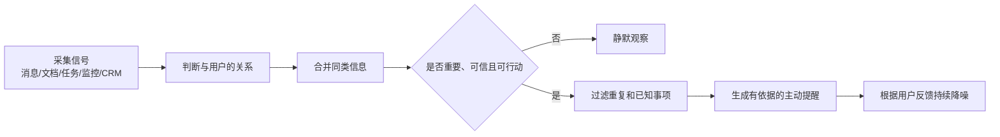

#### 历史对话检索 & 长期记忆

长期记忆这个没什么好说的， 但是历史对话检索功能，居然大家都没有做？？？！！！

当 AI 成为办公中主要的信息载体后，让人能方便的检索历史消息会是非常重要的一个功能；我们也需要一个类似飞书知识问答那样能让 AI 高效检索历史消息，反哺长期记忆的这么一个能力。

#### 企业 CLI 与私有 Skill 生态

Skill 市场是非常重要的，Skill 本质上是垂直业务的最佳解决方案；不少人会为了 Skill 付费，但 skill 像剧本杀一样不具备保密性，很难通过重复兜售 Skill 获得盈利。

真正的壁垒在企业 CLI, 像字节的 bytedcli, 能直接打通 Agent 和字节的内网操作。大多企业不知道怎么构造出这样一个能让内网和 AI 互通的 CLI，并因此而无法把 AI 给用好。 此处 FDE 就要发挥重大作用了。大致的做法是

```Plain Text
企业 CLI / Tool SDK
→ FDE 完成首批内部系统接入
→ Skill 编排工具和业务规则
→ 企业私有 Skill 市场
→ 留下指导迭代 CLI/Skill 的解决方案
→ 合作伙伴与客户自行扩展
```

## 错误的 Agent 设计

### 一切只在服务端运行的 Agent Loop 是没有前途的

Agent Loop 一定要放在客户端，服务端的 Agent Loop 是妥协之举，是没有前途的！

Agent Loop 应尽量和 “状态真相、权限决策、动作执行” 处在同一个信任域。对 Agent 而言，这个信任域通常就是用户本机。代码目录、Git 工作区、进程、凭据和审批界面都在本地，所以 Agent Loop 放在客户端更符合系统边界。

#### 服务端运行 Agent Loop 的根本问题

如果 loop 在服务端、工具却操作用户电脑，系统实际上变成了：

```Plain Text
云端模型 + 云端调度器
        ↓ 长连接/RPC
本地高权限执行代理
        ↓
文件、Shell、Git、密钥、内网
```

服务端运行的 Agent Loop，是一个云端控制、本机执行的远程控制系统。它必须解决**认证、授权、防重放、连接中断、状态一致性、撤销和审计**等一系列问题。

#### 服务端运行 Agent Loop 的 N 宗罪

随着迭代进入深水区，这些对于客户端 Agent Loop 很轻松就能搞定的问题，对服务端 Agent Loop 却不停放大。

| 罪项 | 备注 | 场景 |
|-|-|-|
| 无法通过 “杀掉 CLI” 可靠终止 | 关闭 CLI 可能只是断开界面；服务端任务仍在运行；本地代理也可能继续执行已下发的 cmd 。 | 用户发现 Agent 正在误删文件并关闭终端，但服务端仍继续下发命令。 |
| 状态容易过期或分叉 | 真实工作区在本地，服务端只能持有快照；用户、IDE 与 Agent 的并发修改可能导致判断基于旧状态。 | 用户刚修改配置，服务端仍根据旧版本生成补丁并覆盖新改动。 |
| 难以保证 cmd 只执行一次 | 网络中断时，服务端无法确定操作是 “未执行” 还是 “已执行但回执丢失”；重试可能造成重复操作。 | `npm publish` 已成功，但回执丢失，服务端再次尝试发布。 |
| 强依赖网络与服务可用性 | 每轮工具结果都要跨网络回传；断网、限流或服务故障会让循环停滞或进入不确定状态。非常容易出现超时的情况。  <br/>该问题除了影响用户体验外，还会放大 cmd 只执行一次的问题。 | 这里并非专门针对豆包本地电脑。 |
| 权限边界复杂化 | 云端负责决策，本地负责执行，需要额外处理认证、逐项授权、能力令牌、租约、撤销和审计。 | 豆包要为了 Lark CLI 的认证做一系列额外的开发 |
| 隐私暴露面增大 | 服务端要持续决策，通常需要频繁同步代码、终端输出、日志和环境信息。 | 构建日志中的密钥或内部地址被意外上传到服务端上下文；或者是网络传输过程中通过路由器抓包截获敏感内容。 |
| 本地环境难以准确复现 | 本机的未提交改动、依赖缓存、进程状态和内部工具很难完整同步到服务端。 | 问题只在本地特定 SDK、容器或公司内网环境中出现，云端无法复现。 |
| 实时反馈割裂         | 工具日志、进度、报错需从服务端流回，网络抖动影响"边跑边看"         | 部署日志卡顿、丢流，看不清实时进度 |
| 工具/Skill 生态受限         | 服务端工具是统一预置的，用不上用户本地特有 CLI 与 GUI         | 对于云端 Agent Loop，我能轻松地把 bytedcli 部署上去吗？本地浏览器登录态可以自然接管么？ |
| 列不完，根本列不完 |  |  |

### MCP Tool 是历史认知局限造就的错误产物

> MCP 作为调用适配层的价值正在下降，但工具发现、统一鉴权和权限约束不会消失，只会迁移到服务目录、鉴权网关和 AI 友好的原生接口中。

早期模型能力比较弱的时候，模型调用复杂接口容易出错，也不方便模型训练；当时也没有专门面向模型的接口市场。在这种情况下，MCP 成了大模型工具生态早期的“通用适配层”。现在，**该淘汰 MCP Tool 了！**

- **模型已能调对大部分接口**：对现在的模型来说，直接调用产品原生面向客户的功能接口往往更合理，不必再套一层简化封装。
- **双份维护 + 语义漂移**：MCP Server 常是产品接口的"影子封装"。产品接口一迭代，MCP 层就滞后，长期必然分叉。让原生接口本身做得 AI 友好，能消掉这层维护成本。
- **常是杀鸡用牛刀：**如果工具就是一个本地 CLI 或一个 HTTP API，直接调用更简单可靠，为"标准"套一层 MCP 反而增加进程、协议和维护成本。

MCP Tool 的替代路径

- 原生接口 → 做得更 AI 友好，直接给模型用。
- 复杂到人和 AI 都难理解的接口 → 包装成 `xxx CLI`。CLI 的好处是"人机同源"——人能直接用、能调试、能复现，模型和人共享同一入口，不会分叉。

## 终局-AI 到底是要革程序员的命，还是革命？

> 网上常见程序员的调侃：程序员们一直在革自己的命

过去二十年，开发框架和技术工具几乎每隔一两年就迭代一次，每一次迭代都在实实在在地提高开发效率，做大蛋糕。但当市场趋于饱和、行业增速见顶，前几年过度扩张开始回吐时，效率提升的含义发生了根本性反转：

- 蛋糕在涨时：效率提升 → 被新需求吸收 → 人力不减反增。
- 蛋糕停涨时：效率提升 → "同样的活更少人干" → 直接等价于裁员。

裁员的根因是增长模式见顶，而效率提升（包括 AI）是这个根因的放大器。当生产效率快速迭代，而分配关系没有发生本质变化时，资本逐利的本性必然会推动企业通过裁员扩大收益。

当生产力得到飞跃式提升，生产分配关系会决定我们到底是走向共和还是赡养人类。 

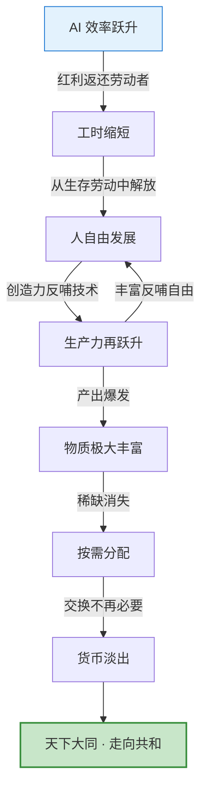

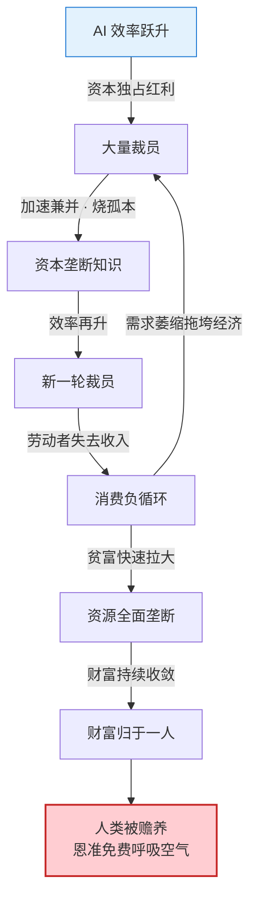


