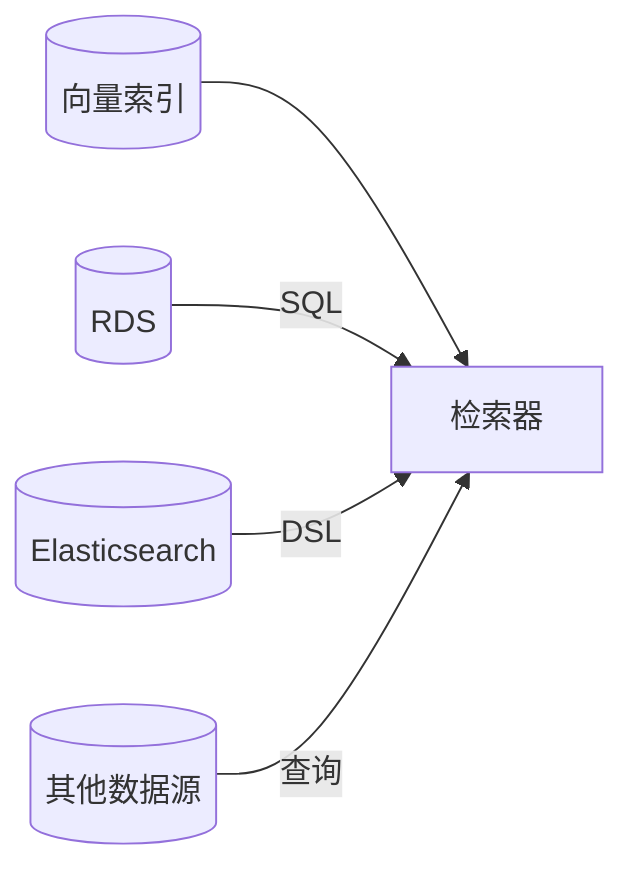
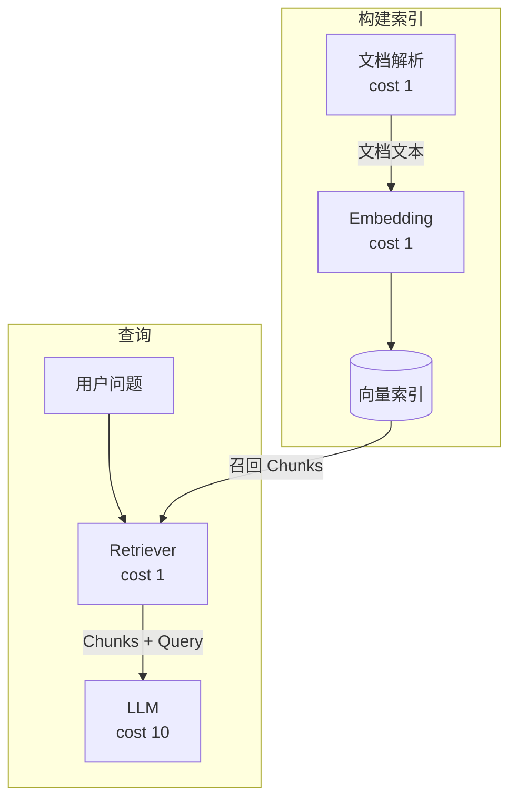
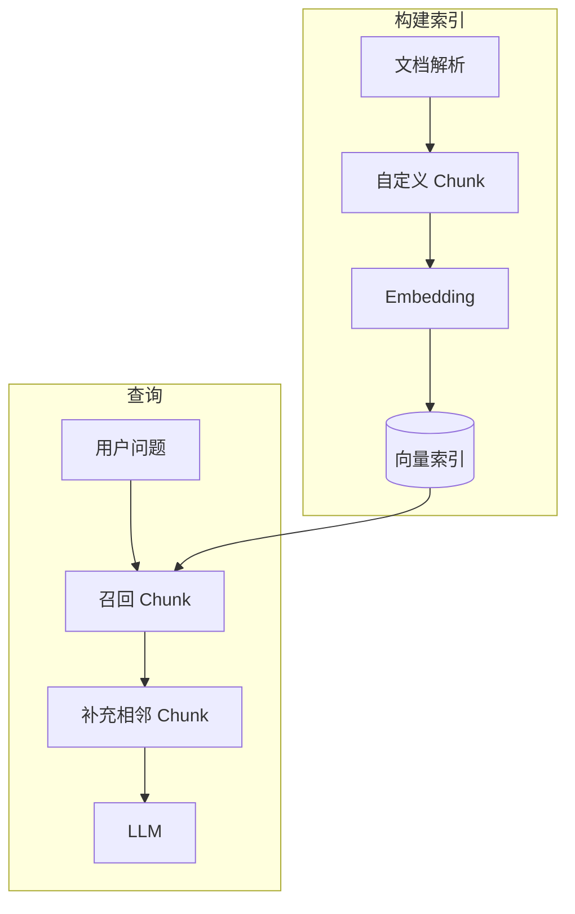
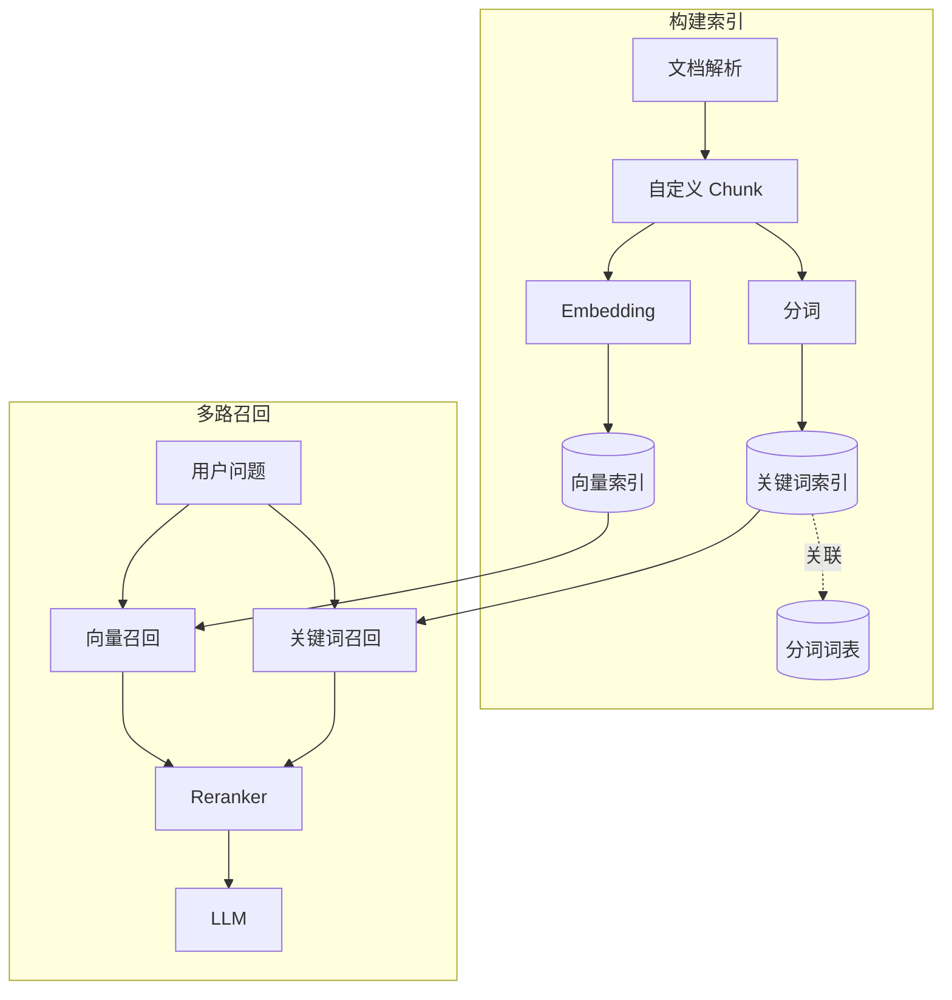
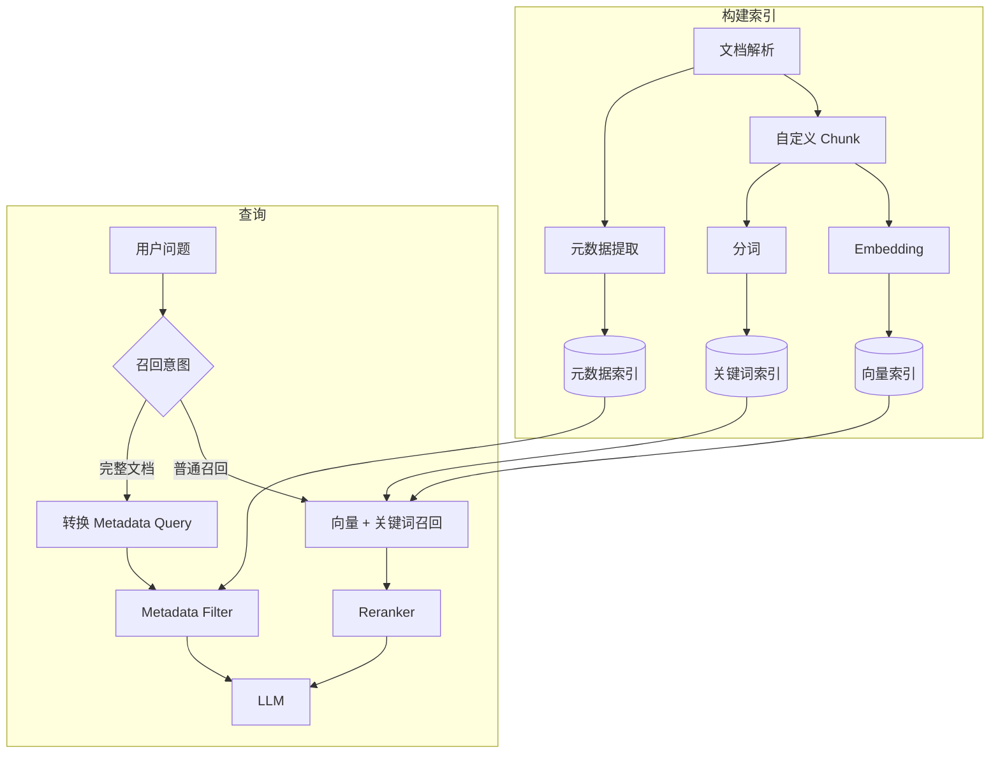
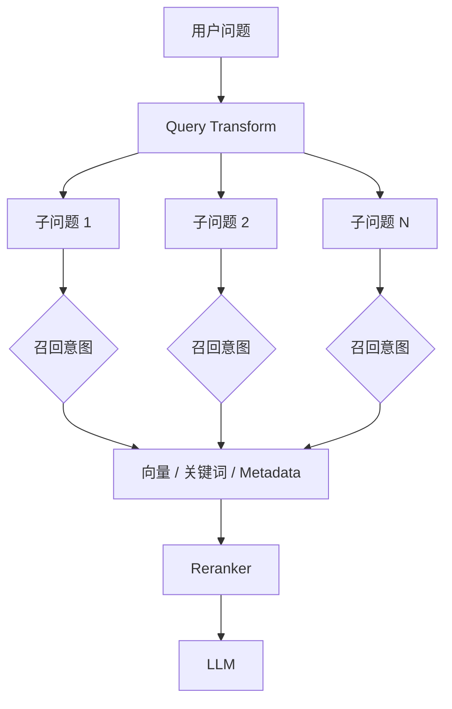
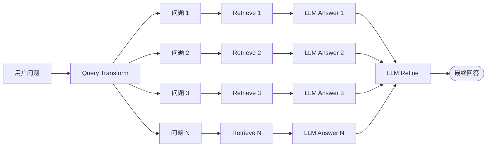
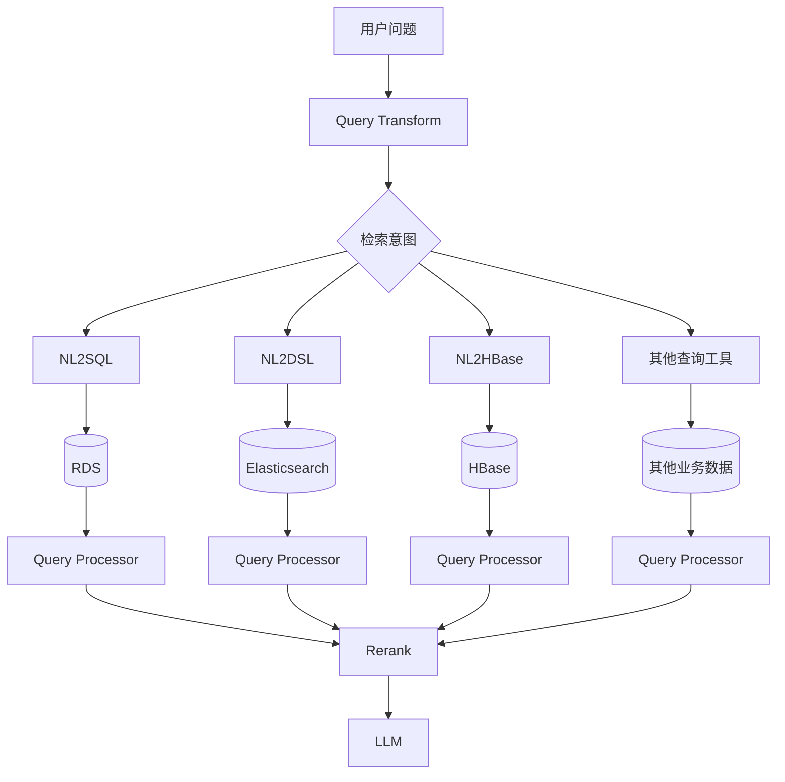

# RAG 岂是如此不便之物：万物皆可 RAG

## 什么是RAG

RAG 全称 Retrieval-augmented generation, 是一种通过检索到的内容提供给大模型生成回答的技术。一般说 rag ，大家默认就是知识库的文档走个向量召回。

RAG 岂是如此不便之物，都叫 retrieval 了，不管啥检索召回丢给大模型我都要管他叫 RAG !

- Sql 可以用于 RAG
- 全文检索可以用于 RAG
- 所有查询都能用用于 RAG



## 搭建 RAG

接下来会讲述从简单到复杂一步步构造 RAG 架构，介绍不同方式 rag 所解决的问题，以及所需要的花销。 

在此我们先有个简单的开销预估:

- 一次普通的服务调用花费 1；
- 一次大模型调用花费 10。

### 基础 RAG

#### 建设与成本

最基础的 RAG，就是文档 embedding 后存储到向量库，再从向量库中召回。



上述流程就是大家平时所说的 RAG 的一个基础流程，是个简单实用花费的成本又小的 RAG 流程。

| 阶段 | 步骤 | 开销 | 总开销 |
| --- | --- | --- | --- |
| 构建索引 | Document parse | 1 | 2 |
| 构建索引 | embedding | 1 | 2 |
| 查询 | Retriver | 1 | 11 |
| 查询 | LLM | 10 | 11 |

#### 遇到新问题

基础 RAG 常遇到的问题是感觉召回的内容不够全，不够准确，上下文丢失到其他 Chunk 里了。具体 case , 比如一句话“张三今天吃了午饭，在鸿宾楼吃的”； 给拆分成了两个 Chunk ["张三今天吃了午饭", "在鸿宾楼吃的"]。当提问“张三午饭”， 可能会只召回了第一个 Chunk 导致回答的不准确或不充分。

我们试着用自定义 Chunk + 临近 Chunk 召回的方式来缓解这个问题。

 

### 自定义 Chunk 拆分策略

自定义 Chunk 拆分策略规避前面提到的上下文丢失问题。

#### 建设与成本

为了解决基础 RAG Chunk 拆分丢失上下文的问题，我们试着引入自定义 Chunk + 临近 Chunk 召回的方案。



这个方案比上述方案多了两个组件，分别解决了以下问题:

- **Custom Split Chunk:**  自定义拆分  chunk 的策略，规避了乱拆 chunk 带来的上下文丢失问题。 怎么拆 chunk 下文继续讲。
- **Neighbors Chunk:** 把会用到的临近 chunk 也召回回来，用来规避 rag 召回 chunk 容易丢失上下文的问题。

虽然加了两个节点，但只增加了一点点成本。

| 阶段 | 步骤 | 开销 | 总开销 |
| --- | --- | --- | --- |
| 构建索引 | Document parse | 1 | 2 |
| 构建索引 | embedding | 1 | 2 |
| 构建索引 | Custom split Chunk(内存计算，开销为 0) | 0 | 2 |
| 查询 | retrive chunk | 1 | 12 |
| 查询 | LLM | 10 | 12 |
| 查询 | retrive neighbor chunk | 1 | 12 |

#### 自定义拆分 chunk 策略

但自定义拆分 chunk 策略怎么做是合适的呢？需要根据自己业务的特点来进行选择不同策略。 首先需要注意到的是 chunk 大小对效果的影响，不论哪种拆分策略都需要考虑 chunk 的大小。

- Chunk 太大的缺点:

  - embbeding 会耗费大量内存，也可能直接导致 embedding 失败； 所以很多系统会设置个 chunk 上限，比如 size <= 8192 。
  - 召回的区分度也会下降。
  - 召回的分片多点就容易撑爆 llm token 上限。
- Chunk太小的缺点:

  - 频繁 embedding 增加开销
  - 拆的太细, 容易丢失很多上下文。

在考虑了 chunk 大小之后，以文档为例，常见有以下拆分策略。

| 策略 | 优点 | 缺点 |
|-|-|-|
| 按长度拆分 | 简单，是很多系统默认的拆分策略。 | 会出现一句话拆分成上下两个 chunk 的情况，导致语义不完整。 |
| 按段落/章节拆分 | 能保证语义的完整性。 | 段落/章节长度不可控, 需要进一步的衍生出各种策略。 比如太短的段落合并，太长的段落二次拆分等。 |
| 按页拆分 | 也是部分系统的默认拆分策略。适合 pdf/word 等文档的拆分策略。 | 也容易出现和按长度拆分差不多的截断上下文问题。 |

对于更精细的拆分策略，则需要根据自己业务特点去定制了。

#### 原问题解决情况

当提问:"张三午饭" 的时候，因为原数据  "张三今天吃了午饭, 在鸿宾楼吃的"， 在新的自定义拆分 chunk 的策略中，把同段落拆分到同一个chunk 中 ["张三今天吃了午饭, 在鸿宾楼吃的"]，且用了临近段落召回的方式来获得保证上下文更加完整。

#### 遇到新问题

在解决了召回上下文丢失的问题后，我们遇到了新的问题，发现有一些 case 在全文检索的倒排索引里，能起到比较好的搜索效果，但通过向量化召回却总是无法命中。包括但不限于以下 case: 

- **拼写错误:** `Helo World` 没能在 Vector Index 中召回， embedding 距离较远，但全文检索能通过单词的最短编辑距离给匹配到 `Hello World`。
- **特定格式或特定术语:** 电话号码 `123-456-7890` , embedding 模型训练的时候不一定涉及到了这些特定术语或格式的内容，在计算向量距离的时候无法得到准确的值。
- **词频权重:** 部分关键词在多个 chunk 都会命中，但不同 chunk 的权重通过 embedding 无法区分，通过词频反倒有更好的效果。 

### 关键词+向量多路召回 + reranker

看起来有很多 case，通过关键词召回比单纯的向量召回能起到更好效果的。 因此可以引入 keyword search 来解决这些问题。

#### 建设与成本



在上述 case 中，我们增加了如下节点:

1. 增加了分词器，把分好的词写入到 keyword index 中
2. 构建索引过程中写入了 `Keyword Index` ，不过部分向量库自身就支持 `BM25` 算法, `BM 25 ` 使用了和全文检索一样的 `TF-IDF（Term Frequency-Inverse Document Frequency）` 算法来根据词频计算权重。这意味着在部分 vector db 的情况下我们不一定真的需要去额外构建 Keyword Index。 
3. 增加了召回 Keywrod chunk, 用来解决只有向量索引的问题
4. 引入了 Reranker 模型， 用来对召回的 chunk 进行重排。

此次变更后 RAG 的总成本增加到 16 (这还删掉了临近召回)。

| 阶段 | 步骤 | 开销 | 总开销 |
| --- | --- | --- | --- |
| 构建索引 | Document parse | 1 | 3 |
| 构建索引 | embedding | 1 | 3 |
| 构建索引 | Keyword Index Storage | 1 | 3 |
| 查询 | Retrieve vector chunk | 1 | 13 |
| 查询 | retrieve keyword chunk | 1 | 13 |
| 查询 | Rerank | 1 | 13 |
| 查询 | LLM | 10 | 13 |

除此之外还引入了新的需要维护的基建: 关键错索引+分词表 + Rerank。

#### Rerank 简介

本次改造中引入了 rerank, rerank 是 rag 中比较重要的一个步骤。Rerank 起到的一个作用是对检索后的内容进行重排二次评估，以选出最适合给模型的 Rerank 方法。不同的 rerank 方法能起到不同的效果，比如:

- Rank-BM25: BM25 的词频等特征计算文档与查询结果相关性得分。
- ColBERT: 基于 BERT 的模型，类似向量库计算语义相似度的做法来进行排序。

 

需要注意的是，如果只有向量索引，且 Rerank 算法和向量索引的排序方法类似，那么 Rerank 可能会起不到什么作用甚至是副作用。 具体例子:

- 向量库返回了 top 10 
- ColBERT 取了前 top5

怎么证明 ColBERT top5 的结果就是比向量库的 top5 的结果更准确呢?

#### 原问题解决情况

因为引入了 keyword search, 原先的词频、拼写错误、特定术语(分词库)等问题本身是全文索引擅长的，自然解决了。

#### 遇到新问题

在引入了多路召回后，召回结果更准确了。 但还有一些 case 没办法解决。 比如有个知识库 `飞书开放平台 API` ，提问:"块的数据结构", 那么这时候无论通过哪种方式都无法完整召回对应文档 [块的数据结构](https://open.larkoffice.com/document/ukTMukTMukTM/uUDN04SN0QjL1QDN/document-docx/docx-v1/data-structure/block), 会丢失部分上下文。

### 召回引入 Metadata Index

像刚才"块的数据结构" 这种需要完整文档的问答 [块的数据结构](https://open.larkoffice.com/document/ukTMukTMukTM/uUDN04SN0QjL1QDN/document-docx/docx-v1/data-structure/block), 是怎么也没办法通过 vector index 或 keyword index 召回所有 chunk 的，因此需要引入 metadata 的概念, 通过 metadata filter 来进行完整召回。

#### 建设与成本



上述流程在构建索引简短，加入了 Metadata Extractors，在查询阶段引入了意图判断和 Tranform Query。

- Metadata Extractors: 根据业务需要提取出文章章节、作者、地址等元信息存储起来
- Retrieve Intent: 意图判断使用哪种召回方式
- Transform Query: 如果是走到了 Metadata Fitler, 需要该 LLM 转换成

引入了 Metadata Filter Tool 和意图判断, 开销从原先的 16 增加到了 40.

| 阶段 | 步骤 | 开销 | 总开销 |
| --- | --- | --- | --- |
| 构建索引 | Document parse | 1 | 6 |
| 构建索引 | embedding | 1 | 6 |
| 构建索引 | Keyword Index Storage | 1 | 6 |
| 构建索引 | Meta DataExtrators + Metadata vector index + metadata keyword Index | 3 | 6 |
| 查询 | Retrieve vector chunk | 1 | 34 |
| 查询 | retrieve keyword chunk | 1 | 34 |
| 查询 | Rerank | 1 | 34 |
| 查询 | LLM | 10 | 34 |
| 查询 | Retrieve Intent LLM 用来判断使用哪个 retrieve tool | 10 | 34 |
| 查询 | Transform Query LLM<br>自然语言转 metadata filter query | 10 | 34 |
| 查询 | Metadata Filter | 1 | 34 |

#### 原问题解决情况

知识库 `飞书开放平台 API` ，提问:"块的数据结构", 根据 metadata title， 命中 title 包含"块的数据结构"的所有 chunk,  [块的数据结构](https://open.larkoffice.com/document/ukTMukTMukTM/uUDN04SN0QjL1QDN/document-docx/docx-v1/data-structure/block)。 模型层拿到完整的上下文，得以更好的回答。

#### 遇到新问题

随着用户量的提升，发现了一些召回的 badcase， 比如下面这个 case:

| 问题 | 知识库内容 | 召回情况 |
| --- | --- | --- |
| 特斯拉经营状况 | 特斯拉的销售额是 xxx 亿，利润是 xxx 亿，卖出车辆 xxx 辆。 | 句句不提经营状况，字字不离经营状况。 但在很多 向量化模型里，这段话可能因为 score 较低而无法召回。 |
| 然后呢？<br>继续<br>接着说 | 跟内容已经无关了 | 完全召回不了 |

### Query Transform 

上述的问题，在 rag 中是很容易遇到的，对用户的原始问题进行转换后， 往往可以得到比较好的结果。 大致的方向是需要把用户的原始问题拆成以下两部分:

- 回答用户的问题需要什么数据，此处大多是以 SubQuestion 的方式返回多种数据。
- 基于数据需要怎么回答用户的问题。

#### 建设与成本



构建索引过程没变，但是在查询环节前置了个 Query Transform Tool, 将用户的原始问题拆分成 N 个子问题。为了方便计算开销，沿带着下游召回的开销都需要 x N 。 为了方便理解，此处将 N = 3 , 总开销从 34 变为了 92 。

| 阶段 | 步骤 | 开销 | 总开销 |
| --- | --- | --- | --- |
| 构建索引 | Document parse | 1 | 6 |
| 构建索引 | embedding | 1 | 6 |
| 构建索引 | Keyword Index Storage | 1 | 6 |
| 构建索引 | Meta DataExtrators + Metadata vector index + metadata keyword Index | 3 | 6 |
| 查询 | Retrieve vector chunk | 1 * N | 20+24*N(3) = 92 |
| 查询 | retrieve keyword chunk | 1 * N | 20+24*N(3) = 92 |
| 查询 | Rerank | 1 * N | 20+24*N(3) = 92 |
| 查询 | LLM | 10 | 20+24*N(3) = 92 |
| 查询 | Retrieve Intent LLM 用来判断使用哪个 retrieve tool | 10 * N | 20+24*N(3) = 92 |
| 查询 | Transform Query LLM<br>自然语言转 metadata filter query | 10 * N | 20+24*N(3) = 92 |
| 查询 | Metadata Filter | 1 * N | 20+24*N(3) = 92 |
|  | QueryTransform Tool | 10 |  |

#### Query Transform 简介

原始问题作为检索查询可能不是最优的。例如，问题可能需要被重写或简化，从而更容易匹配知识库中的文档。可能涉及到同义词替换、去除无关信息或将问题转换为关键词、增加时间维度、衍生出多个问题。

Query Transform 的简单实现可以是一个 prompt 。

```Plain Text
你的职责根据用户的聊天记录和问题拆解出用户关心的问题需要哪些数据，根据用户的问题拆出 1-5 个所需要数据的描述。
今天的时间是{today}, 遇到时间相关问题时候请根据今天的时间推理。

以下是一个示例
------------------
问题: 拼多多股票
回答: ["拼多多财报详情", "拼多多股价波动原因", "拼多多面临的市场竞争", "拼多多股票未来走势预测"]
------------------

聊天记录: {history}
问题: {query}
```

#### 原问题解决情况

| 问题 | 知识库内容 | 拆分情况情况 | 备注 |
| --- | --- | --- | --- |
| 特斯拉经营状况 | 特斯拉的销售额是 xxx 亿，利润是 xxx 亿, 成本是 xx 亿， 面临比亚迪的竞争…… | ["特斯拉最新财报摘要", "特斯拉市场份额和销售数据", "特斯拉近期的经营策略和新闻", "特斯拉的利润率和成本控制情况", "特斯拉面临的行业挑战和竞争分析"] | 拆出多个维度的问题, 很容易就把问题给召回回来了。 |
| 然后呢？ |  | ["特斯拉最近季度的财务报告详细内容", "特斯拉汽车销售和平均售价的具体数据", "特斯拉能源业务的市场表现和增长数据", "特斯拉面临的市场竞争和挑战的具体情况", "特斯拉未来的营运计划和战略方向"] | 继续召回各种特斯拉经营状况相关的内容。 |

可以看到上述例子，成功的解决了用户问题不适合搜索，通过拆分多个维度的问题，来提高召回率和召回的准确度。 现在**豆包的搜索技能，就做了比较多 Query Transform 的优化**。

Llama index 的文档里介绍了另外一种 Query Transform 的做法，大致流程如下。



这种做法的优势在于:

- 每个拆分出来的问题都是单独和 LLM 交互的， chunk 是更少的，不容易出现超 token 的情况。
- 模型对拆分出来的单个问题单独回答，容易得到更深度的解答。
- 本质上是个并行的 Map-Reduce 模型，Map 阶段的并发容易得到更高的响应速度。

但其有个致命的缺点:

- Map 阶段的内容经过最后一个节点的总结，往往会丢失非常多的信息。 使得整个回答**结果饱满程度不够**。所以大多时候并不推荐这种做法。
- 整体上和大模型交互的次数变得更多，开销更大。

#### 遇到新问题

有很多业务数据，存储在 mysql/ elasticsearch 中，几乎无法向量化，又想召回作为知识库回答的一部分怎么办?

### 万物皆可 RAG

现存的业务数据中，有非常多适合拿来召回增强内容生成的内容， 尤其是本来就用于搜索的全文搜索引擎。 在特定的业务场景，这些内容拿来增强回答会有非常好的体验。

#### 建设与成本

为简化阅读，本流程不再赘述构建索引以及向量召回部分逻辑。



这个因为直接使用的现有业务数据，构建向量库的成本反倒没有了，但查询成本还在。假设 Query Transform 还是拆出 N 个问题，假设 N=3, 那么一轮提问所需开销是 86。 

| 阶段 | 步骤 | 开销 | 总开销 |
| --- | --- | --- | --- |
| 查询 | QueryTransform Tool | 10 |  |
| 查询 | NL2Sql/DSL | 10 * N | 20 + 22N |
| 查询 | Query processor | 1 * N | 20 + 22N |
| 查询 | Rerank | 1 * N | 20 + 22N |
| 查询 | Retrieve Intent LLM 用来判断使用哪个 retrieve tool | 10 * N | 20 + 22N |
| 查询 | LLM | 10 |  |

## 总结回顾

对比下各种阶段所用的 RAG 开销

| RAG 方式\组件 | 适用场景 | 向量库 | 自定义 Chunk 策略 | Keyword search | reranker | Metadata filter | Query transform | NL2xx | 成本预估 |
|-|-|-|-|-|-|-|-|-|-|
| 基础  | 简单的知识库问答 | ✅ |  |  |  |  |  |  | 13 |
| 自定义 Chunk 拆分 | 简单的知识库问答 | ✅ | ✅ |  |  |  |  |  | 14 |
| 多路召回  | 需要精准召回的知识库问答 | ✅ | ✅ | ✅ | ✅ |  |  |  | 16 |
| 多路召回+Metadata | 需要精准召回的知识库问答 | ✅ | ✅ | ✅ | ✅ | ✅ |  |  | 40 |
| Query Transform | 不差钱、对耗时不敏感的 RAG 场景 | ✅ | ✅ | ✅ | ✅ | ✅ | ✅ |  | 92 |
| 万物皆可 RAG | 数据不好向量化又想让模型直接使用的场景。 |  |  |  | ✅ |  | ✅ | ✅ | 86 |
