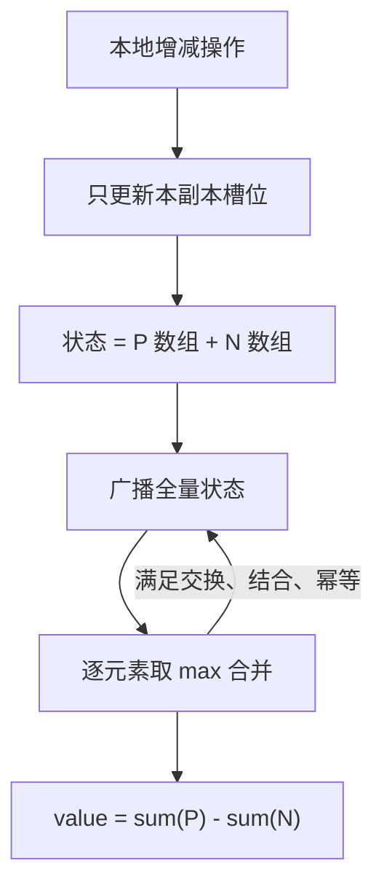
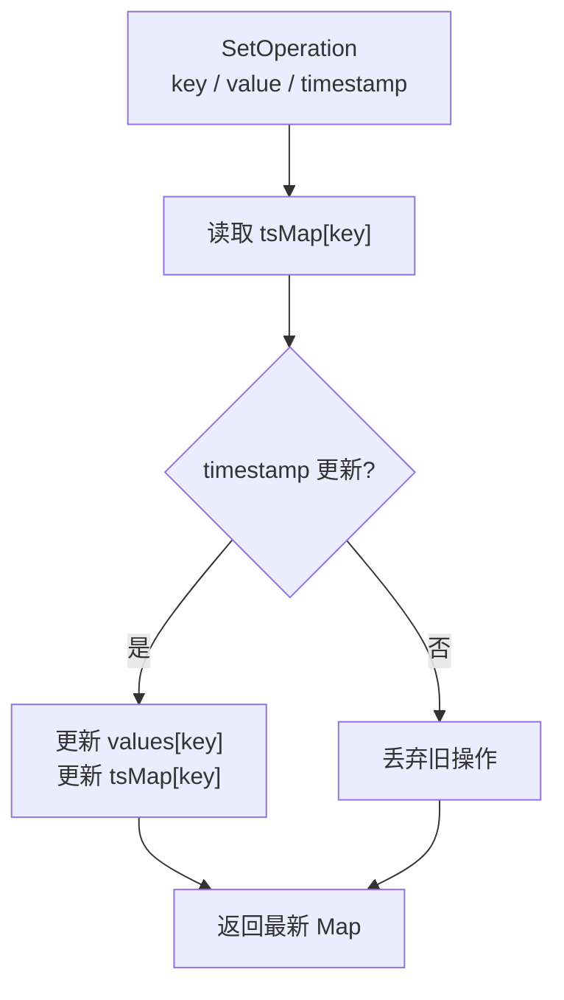
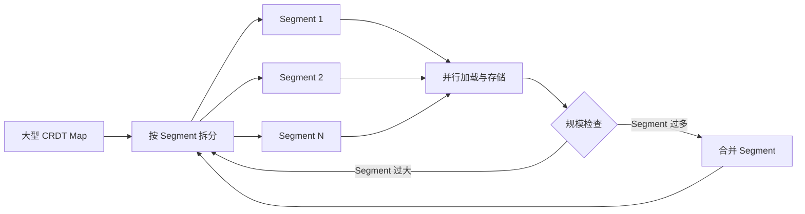

# 协同算法：CRDT 的原理与实现

> 上一篇：[协同算法：OT 和 CRDT 的原理与差异](ot-and-crdt-principles.md)，侧重描述 OT 算法的原理和 CRDT 的概述。

大家平时使用的doc文档/协同画板等工具，是可以多人同时进行编辑的，那么这种情况下不可避免的会存在冲突, 而协同算法就是为了解决这些协同冲突而出现的。更多的协同场景，[点击体验微软协同小应用](https://fluidframework.com/playground/?path=/docs/react-demos-draft-js--demo)。

CRDT和OT都是常见的协同算法，本文介绍CRDT算法的原理，并从op-based和state-based的角度举出简单的实现方式。文中会有一些术语，CRDT特有的术语会在第一次出现的时候做术语解释，不属于CRDT的术语是如下:

- **逻辑钟:** 分布式系统的特性，其时间值逼近于现实时间。 其特点是两个事件不可以同时发生，哪怕两个事件发生在同一微妙中，在逻辑钟里也有先后之分。
- **最终一致性:** 各个副本的最终状态是一致的。
- **强最终一致性:** 在最终一致性的基础上, 需要额外满足执行相同操作集合的副本要具有相同的状态。也就是各个副本的中间状态也是一致的。CRDT采用的是强最终一致性。

## 1 简介

CRDT全称是Conflict-free Replicated Data Type，直译是无冲突可复制数据类型。**CRDT并不是指一种具体的算法实现，而是指能自动处理协同冲突的数据类型的统称**。string/map/list/counter等数据类型都可以做成CRDT，具体冲突解决由数据类型内部决定， 比如可以用ot算法来包装出一个CRDT的string。

CRDT有基于操作(Commutative Replicated Data Type, **CmRDT, Op-Based**)和基于状态(Convergent Replicated Data Type ,**CvRDT, State-Based**)两种实现，两种实现解决的本质问题是相同的，只是实现方法不同而已。另外还有两种混合起来的 Dela-based的做法，该做法在本文中不做详细介绍。

### 1.1 基于操作的CRDT(CmRDT)

基于操作的CRDT, 被称为CmRDT(CmRDT, Commutative Replicated Data Type, Op-Based)，本文中出现的CmRDT或者op-based都是表示基于操作的CRDT。其更新内容都被定义为operation，各个协同副本通过同步并执行operation来达到**强最终一致性**。基于操作的operation需要满足如下特性: 

- operation要么满足**因果序**，要么满足**可交换性**。 在数据不丢的情况下，只要operation满足这两点，就可以达到强最终一致性的效果。

  - **因果序:** operation2是基于operation1产生的, 那么在所有的副本上，operation1必须要比operation2更早执行； 由于实现中比较难以区分两个op是否有因果关系，因此对这种case经常会采用全局序的方式来实现(2.2 的全局序仲裁)。
  - **可交换性:** 有的crdt的operation，是可以容忍乱序的，无所谓谁先后执行，只要operation不丢即可。详见2.1交换性和关联性。
- 同步机制上，必须要operation的执行满足 **exactly once** 的保证。 多执行或者少执行都会导致数据异常。

现在开源的CRDT框架大多会选择op-based或delta-based的方式来实现，相比state-based，其存在如下优缺点:

- **优点:** 消息传递的是operation，消息体小，相对并发要求更高。
- **缺点:** operation的执行需要满足`exactly once`，同步协议要求高。

### **1.2 基于状态的CRDT(CvRDT)**

 基于状态的CRDT被称为CvRDT（CvRDT,Convergent Replicated Data Type, state-based)，本文中出现的CvRDT/state-based都是指基于状态的CRDT。可以简单理解为每个副本都存着自己的全量数据，所有副本合并后，是一分全量的完整的数据。每次更新的时候，都会把自己的全量的数据同步给其他副本。其实现存在如下条件：

- 状态要满足单调性，也就是状态是单向的，每次op的操作，其副本状态是不会重复的。为方便理解，此处以Counter举例:

  - rep1 = counter(0), rep1.value = 0
  - rep1' = counter(0) + 1, rep1'.value = 1
  - rep1'' = rep1 +1 -1, rep1''=0
  - 虽然rep1和rep1''值相等，但其状态要满足单调性，rep1 != rep1''
- 消息要最终可达，state-based的消息是可以重发但不可丢失的。
- 状态更改操作为merge， 其merge需要满足交换性和关联性。也就是当状态合并的时候，`merge(a,b)=merge(b,a)merge((a,b),c)=merge(a,(b,c))`
- 状态变更操作的merge要满足幂等， 和op-based不同的是，op-based多次apply(op)会重复执行，而state-based的多次merge并不会变更最终状态。 也就是`merge(a,b)=merge(b,a)=merge(a,(a,b))`。 具体例子就是

  1. `listA=[1,2,3], listB=[2,3,4]; `
  2. `listC=merge(listA,listB)=[1,2,3,4]; `
  3. `listD=merge(listC,listA)=[1,2,3,4]=listC` 多次merge了listA后，其最终状态和只merge一次是相同的。

基于状态的CRDT存在如下优缺点:

- **优点:** 同步协议要求低，可尝试多次重发消息。
- **缺点:** 同步的时候每次都是一个完整的副本广播给其他端，消息包太大。

### 1.3 实现选型

我们已经知道了CmRDT和CvRDT的优缺点了，在开始设计实现CRDT之前，先来看下什么场景下该做哪种选择。

- **高时效需求:**  有这种需求的就不方便选state-based，因为state-based每次同步都是要同步一个全量的副本，数据包大，并发量自然低。 可以选择op-based或delta-based。
- **同步失败可多次重试:** 想要同步失败可重试， 那state-based会是个比op-based更好的选择。 op-based要求`exactly-once`,同步协议上会更复杂。 而state-based会简单的多， 同步失败后不停的重试直到成功就可以了。

## 实现CRDT

### 2.1 交换性和关联性

- **交换性:** 其更新操作是可交换/乱序的,  Oa + Ob = Ob + Oa;  
- **关联性:** ( Oa+ (Ob+Oc ) = ( Oa+Ob ) +Oc ), 更新不需要分组最终的结果也是一样的。有的数据类型的更新是存在因果序的，就需要让该部分更新以按照因果序的分组执行, 要求因果序的CRDT就不会要求关联性。对于部分CRDT数据类型，其协同更新的本质就是满足交换性和关联性。满足交换性和关联性的情况下协同冲突很好实现，然而并不是每种CRDT都可以满足这两点的。接下来会以计数器为例分别介绍下op-based和state-based如何实现。

#### 2.1.1 CmRDT

像这种只要满足交换性和关联性的CRDT，用一个基于op的方式去非常简单，每个副本只需要维护最终的值就行，其更新操作也只是一个简单的修改值操作，各副本只要执行的op不丢，最终状态肯定是一致的。当然Op如何保证`exactly once`会是个问题，但该问题不在本章节讨论范围，先跳过。

比如一个Counter类型的CRDT数据结构。其update操作就是一个IncrementOp； 对该op进行本地执行并广播给其他副本即可。

```TypeScript
//基于op的CRDTCounter伪代码示例
interface IncrementOp {
    int increment;
}

Counter {
    int val;
    value() {
        return val;
    }
    
    increment(int increment) {
        //生成op
        incrementOp = {increment: increment}
        //执行op
        applyOp(op);
        //广播op给其他协同副本
        brodcast(incrementOp)
    }
    
    applyOp(IncrementOp op) {
        this.val += op.increment;
    }
    
    //执行远端op
    processRemoteOp(IncrementOp op) {
        applyOp(op)
    }
}
```

#### 2.1.2 CvRDT

而基于状态的实现，可以依靠交换性和关联性计算出每个副本变更的部分值，并将该部分值合并成一个全局的最终值来。 

Counter的值为所有副本的merge，每个节点只更新自己副本的状态，其在各个节点的副本上的部分数据如图所示。



可以看到这里把正数和负数拆分成了两个数组，这是有必要的。 如果只用一个数组来标识，那这种做法是不满足2.1.2CvRDT中要求的**状态满足单调性**，其他端并不能理解这到底是一个减操作还是该rep的广播在失败重试，当广播副本的时候，也不满足state-based的**幂等性**要求。如果只用一个数组的话就会存在如下case：

1. rep1=1; 执行+1, 则rep1 = rep1 + 1=2; 广播rep1=2全量状态
2. rep2接收到了rep1=2，执行merge(rep2, rep1)
3. rep1=2; 执行-1, 则rep1= rep1-1 = 1; 广播rep1=1全量状态。
4. rep2接收到了rep1=1 ,  由于rep1不满足单调性，rep2并不知道rep1是在进行请求重试还是执行了decrement操作。以上便是state-based的CRDT的实现, 明显会比op-based的实现要复杂。 但由于其不需要满足`Exactly Once` ，如果不考虑数据包传输的大小，由于其分布式的特性，一些特定的CRDT结构性能有可能会比op-based更好。

   ```TypeScript
   Counter {
       //正数值,有几个副本就有几个正数值,初始值都为0
       int[] posVal;
       //负数值,有几个副本就有几个负数值，初始值为0
       int[] negVal;
       value() {
           return sum(posVal)+sum(negVal);
       }
       
       increment(int increment) {
           //当前副本的索引位置
           let repIdx = repIdx()
           //正数修改posVal数组，负数修改negVal
           if (increment >0 ) {
               posVal[repIdx] += increment;
           } else {
               negVal[repIdx] += increment;
           }
   
           //把自己的全量数据广播op给其他协同副本
           brodcast(this)
       }
       
       //执行远端op
       merge(Counter x, Counter y) Counter {
           let nodeCount = getNodeCounter();
           Counter z = new Counter();
           for i=0;i<nodes;i++ {
               z.posVal[i] = max(x.posVal[i], y.posVal[i]);
               z.negVal[i] = max(x.negVal[i], y.negVal[i]);
           }
           return z;
       }
   }
   ```

### 2.2 全局序仲裁

不同于2.1 满足交换性和关联性的CRDT, 基于`LWW(Last Write Win)` 原则的CRDT都需要依赖全局序来进行冲突处理，在这种情况下，CRDT需要记录进行仲裁的必要信息。对于多人协同编辑的`String、Map、Set`等类型的CRDT，大多会采取`LWW`的策略来决定Operation的偏移顺序或覆盖顺序。具体例子:

- **String:** op1 = string.insert(0, "hello"); op2= string.insert(0,"world"); 其插入的position存在冲突，那么服务端会以`LWW`的策略决定哪个op插入0，哪个op作为follow偏移自己插入的位置。
- **Map:** op1 = map.set("key", "v1") ; op2 = map.set("key", "v2"); 服务端根据接收到的op时间，决定谁覆盖谁。而要做全局序，方式一般由逻辑钟或者某个中心化服务来按接收时间进行全局排序等。**满足全局序的必然满足因果序**, 满足因果序并消息不丢的情况下,必然满足强最终一致性。这里我们假设就是有个现成的逻辑钟来满足排序问题，依旧不考虑`Exactly Once`问题。 

#### 2.2.1 CvRDT

这在state-based的CRDT里比较常见。 每个副本都存有全量的数据， 谁更晚更新谁就生效，其伪代码如下:

```TypeScript
Count {
    int val;
    long timestamp;
    
    value() {
        return val;
    }
    
    increment(int increment) {
        this.val += increment;
        this.timestamp = getLogicTimestamp();
        boradcast(val);
    }
    
    merge(Count x, Count y) z {
        let z = new Count();
        if x.timestamp > y.timestamp {
            z.val = x.val;
            z.timestamp = x.timestamp;        
        } else {
            z.val = x.val;
            z.timestamp = x.timestamp;     
        }
        return z
    }
}
```

可以看到，LWW风格的是直接覆盖掉另外一个人的。

#### 2.2.2 CmRDT

用map来展示全局序仲裁的作用，map存在set/remove/clear三种更新操作，分别对应 setOperation、removeOperation和clearOperation三种Operation。 map中对应的key为一个状态， 其状态的更新采取`LWW`的策略。而setOperation/removeOperation/clearOperation之间存在冲突，由于此处只讲全局序和LWW，为方便理解，暂时忽略掉三个Op之间的冲突，此处只讲最简单的setOperation。 



每个key都会维护自己最新的一次timestamp，setOperation的处理过程如上。其伪代码示例:

```TypeScript
interface SetOperation {
    string key,
    string value,
    number ts,
}

Map {
    //缓存key的最近一次操作时间
    map<string, number> tsMap;
    //map的正式值
    map<string, string> values;
    
    values() {
        return this.values;
    }
    
    set(string key, string value) {
        number ts = getLogicTime();
        tsMap.set(key, ts);

        //本地先更新
        values.set(key, value);
        //广播op    
        SetOperation op = new SetOperation {key: key, value: value, ts: ts};
        broadcast(op)
    }
    
    //处理远端消息
    applyRemoteSetOperation(SetOperation op) {
        let currentTs = tsMap.get(op.key);
        if (op.ts > currentTs) {
            values.set(op.key, op.value);
        }
    }
}
```

### 2.3 唯一标识和tombstones (墓碑)

有的CRDT类型会高度依赖于唯一标识，比如Set/Map等。 2.2.2 中的map便是利用了唯一标识和墓碑，此处不再赘述。

但在完全state-based的CRDT中就会遇到一个问题：不能区分未创建和已删除的状态。当rep1=rep2的时候，rep2.remove(key)； 这时候rep1有key的状态，而rep2的key唯一标识却已经不存在了，当merge(rep1, rep2)的时候，到底如何merge最新状态就不是很明朗了。

为了解决这个问题，一些state-based的CRDT设计出了tombstones (墓碑)来标记已删除的唯一标识。 其关键想法是每个副本中都会维护唯一标识符， 如果一个副本的内容中不存在该key,但是墓碑中存在该key，则认为是已删除的;对于删除后再创建的，则是用删除时间对应的ts来判断。**2.2.2伪代码示例部分的tsMap就是一个这样的墓碑实现**，不过那个是op-based的角度实现的，现在站在state-based的角度再来看一遍伪代码。

```TypeScript
Map {
    //墓碑，缓存所有的key和操作时间,删除和更新操作都会修改该map
    map<string, number> tsMap;
    //值
    map<string, string> values;
    
    values() {
        return this.values;
    }
    
    //为方便阅读,set内容为空
    public void set(string key, string value)
    
    //x和y为两个副本，遍历x和y，当发现x和y内容不相同的时候根据tsMap来判断应该取谁的值
    public void merge(Map x, Map y) Map {
        //遍历x和y，若x和y中内容不相同，则根据tsMap来判断该取谁的
        Map z = new Map()
        
        //循环遍历x内容，取tsMap为最新的作为value
        for (xk,xv) in x.values {
            yv = y.get(xk);
            if (xv != yv) {
                xTs = x.tsMap.get(xk);
                yTs = y.tsMap.get(xk);
                if (xTs > yTs) {
                    z.set(xk, xv);
                } else {
                    z.set(xk, yv);
                }
            }
        }
        
        //循环遍历x内容，取tsMap为最新的作为value
        for (yk,yv) in y.values {
            xv = x.get(yk);
            if (yv != xv) {
                xTs = x.tsMap.get(xk);
                yTs = y.tsMap.get(xk);
                if (xTs > yTs) {
                    z.set(xk, xv);
                } else {
                    z.set(xk, yv);
                }
            }
        }
        
        return z;
    }
}
```

但墓碑存在一个缺点是，墓碑会不停的记录已删除的数据，其需要一个GC机制，或者有一个类似LRU这样的历史墓碑的淘汰策略。

## 3 优化

### 3.1 Exactly-once

op-based的CRDT对operation的执行要求是`exactly-once` ，如果operation是幂等的那自然更好，但在真实的场景中，要把op设计成幂等的会非常复杂， 如果真的要用op的metadata来满足幂等，会把设计变复杂，容易得不偿失。

如果让同步协议在广播的时候通过消息队列来做`exactly-once`的话，又会损失较多的同步性能。

因此可以采用一个**推拉结合的方案**来保证消息广播到客户端为`exactly-once`的做法。 其大致做法是:

1. 有个中心化的排序服务端，该服务端接收到operation后给排序，并将排序的内容设置为operation的version， 完成后广播给客户端
2. 客户端接收服务端的广播，绝大部分情况下operation基本会按照version有序到达客户端的。 当客户端发现version有跳号的情况的时候，让客户端主动去服务端拉取跳号的version，以满足**必达**;如果收到的远端operation的version小于自己当前最新的version则认为是已处理的，忽略该operation，以满足**只执行一次**。

### 3.2 大对象支持

对于一些极端的场景， 一个具体的CRDT实例可能会很大。 比如doc或者画板，可能存在几mb甚至更大的情况，大对象在数据存储和协同推送上都很容易带来性能问题。

而state-based因为要同步全量的副本数据来做merge，因此对于大对象的业务用state-based的实现肯定行不通，只能用op-based来实现。

 当update一个这样的大对象的时候， 我们只广播传输被变更的这一小部分数据对应的operation，以此来降低网络传输的压力。

而除了网络传输以外， 在对象加载和存储的时候也可能会遇到相同的问题。 比如一个map存储了非常多的对象，要加载一个这样的map肯定会耗时较多， 那么可以尝试把这个map切成多个segments， 存储和加载的时候都按照segment来进行并发操作。



当然，需要有个机制来保证segment不要无限扩张或segment过大，segment太多的时候要merge, segement太大的时候要split。一个可参考的做法是[elasticsearch的segment实现](https://www.elastic.co/guide/en/elasticsearch/guide/2.x/merge-process.html)。

### 3.3 空间复杂度

CRDT的空间复杂度取决于每个CRDT每个时刻存储的数据、使用的数据结构和元数据。 对于一部分state-based的且设计了tombstones(墓碑)的数据来说，因为其要维护历史的已删除元数据，其所占的存储空间可能远大于其真实的数据。

而对于op-based的数据来说，一个数据的最新状态是从第0个operation一直到最新operation的集合，相当于存储了历史的所有的operation。

因此对于CRDT来说，不管是state-based还是op-based，都需要一个合理的GC机制来防止数据无限膨胀。说两个简单的做法:

1. 对于state-based，对墓碑进行每隔一段时间的所有副本做一次全量merge， 比如把大家都标记为已删除的墓碑数据，进行回收;
2. 对于op-based , 定制 opeartion 生成 snapshot 规则， snapshot 为从开始到该时刻所有 Operation 合并出来的一个状态， 将已合并到 snapshot 中的 operation 进行回收处理。

CRDT的时间复杂度取决于CRDT的实现， 因此此处就不讨论时间复杂度了。

### 3.4 可逆计算

撤销(undo)/ 重写(redo)在文本编辑和事务计算时候都是一个不可避免的事情。undo/redo 并不是一个简单的事情。对于简单的数据类型可以通过`InvertOperation(op)`来解决,比如Counter的IncrementOperation的undo就是`InvertOperation(op)`成一个DecrementOperation。 

但对于复杂的数据类型，就要复杂很多，因为这可能会关系到：因果序和意图一致性的问题。 其做法可以参考 [《协同算法：OT 和 CRDT 的原理与差异》](ot-and-crdt-principles.md) 文中的 undo/redo/do 章节。
