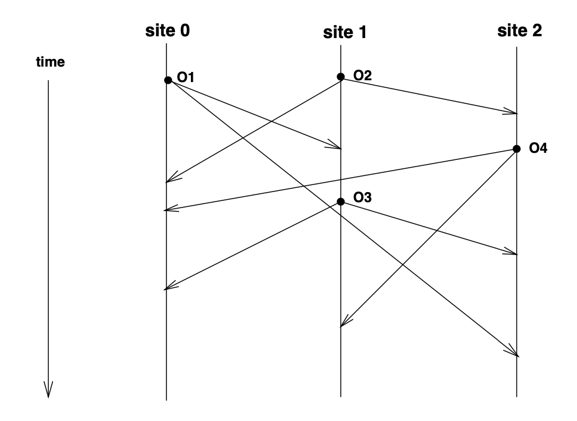
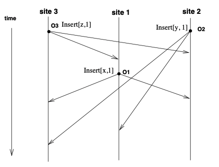

# 协同算法：OT 和 CRDT 的原理与差异

OT和CRDT是现在常用的协同算法，市面上各大协同产品用这两种算法实现的都比较多。本文详细介绍OT算法和CRDT算法的原理和优化，并对比OT算法和CRDT算法的差异。

## OT算法

OT算法体验地址: http://operational-transformation.github.io/ ，Google doc采用的是OT算法实现的。

> 本章节重点参考文献: https://citeseerx.ist.psu.edu/viewdoc/download?doi=10.1.1.53.933&rep=rep1&type=pdf

### 无协同算法的情况

O1-O4是operation，Site是Operation的发起和执行者。



如上图所示，各site的执行结果是:

- site0: O1->O2->O4->O3
- site1 O2->O1->O3->O4
- site2 O2->O4->O3->O13个site发出来4个独立的Operation，但3个site拿到的结果都不相同，不符合因果序，这导致每人的最终结果不同。于是1989年GROVE公司(GRoup Outline Viewing Editor,看名字就是协同编辑器)提出了协同算法。

### Grove的协同算法

1989年GROVE公司明确了协同算法最终要到达的目标：

- **Convergence property:** 结果最终一致性, 所有操作结束时，所有site的文档是相同的;
- **Precedence property:**  因果一致性，如果Ob基于Oa产生Oa->Ob，那在所有site上的执行顺序Oa一定要先于Ob。

#### Transformation函数

OT算法是Operation Transformation,每次收到协同编辑的operation的时候如果直接在本地执行肯定是不行的，需要对收到的operation做一些转化，负责做这个转化的函数就是Transformation函数。

OT算法要求Transformain函数满足该特点：

- **Operation Transformain可乱序:** 对于两个独立的Operation，如果Oa' = T(Oa, Ob), Ob'=T(Ob,Oa), 则必须要有 Oa+Ob' = Ob+Oa'(最终一致性)。执行前文档内容相同，不管Oa,Ob哪个先收到，执行后的文档内容也相同。
- **non-serializable:** 不知道怎么翻译，举例就是Oa和Ob都对同一个目标位置做删除一个字符的操作，那么这两个Operation最终只会删除一个字符。

#### dOPT算法

最早的OT算法，还是GROVE提出来的，dopt(distributed operation transformation)算法不关心T的具体实现，而是负责解决最终一致性的问题,但是要求T满足上述两个要求。

dOPT会把所有的历史执行的operation都存储成log,通过存储的log来判断最终该执行怎样的operation。当新来一个Operation的时候，会把新来的Operation拿来和T做转换，得到最终的EO，执行EO，并将EO写入Log。其伪代码如下:

```JavaScript
//o是operation, logs是所有operation执行历史
func dOPT(o, logs) {
    eo = o;
    foreach (log:logs) {
        //log和当前o有关系才转换  
        if (log || eo) {
            eo = T(eo, log)
        }
    }
    
    execute(eo);
    logs.append(eo)
    
}
```

#### dOPT的问题



假设现在有个Transformation算法，该T算法冲突处理的逻辑: 当往同一个位置插入字符的时候，低优先级的site会自动偏移。 比如优先级site3>site2>site1,操作如上图所示。则对于site3来说，其操作是这样的:

1. O3 insert[z,1] ,log为[O3], 得到 z
2. O1 是在基于O3的基础上产生的，执行insert[x,1],不存在O3||O1的关系 ,log为[O3,O1], 得到xz
3. O2 insert[y,1], O2'产生的时候和O1,O3无关且与O1,O3产生冲突，所以要与他们进行以下T转换:

   1. O2' = T(O3, O2) = insert[y,2]
   2.  EO2 = T(O2', O1) = insert[y,2]  
4. 最终得到结果 xyz 对于site1来说，其操作最终结果也是xyz。但对于site2来说，其操作是这样的:
5. O2 insert[y,1] , log为[O2],得到y, 
6. O3 insert[z,1], EO3=T(O2,O3) = insert[z,1], log为[O2, EO3], 得到zy
7. O1 insert[x,1] , O1'=T(O2, O1) = insert[x,2],O1是基于O3产生的，不需要做T
8. 最终结果zxy遇到这种情况，dOPT的算法就会出现不一致的情况，这并不是一个通过调整T的优先级顺序就能解决的问题。为了解决这个问题，社区提出了非常多的优化方法。举例：

- REDUCE提出了`do/undo/redo`,`IT&ET`,`Context`等概念来解决该问题
- Jupiter使用一个二维的数据结构来维护Operations历史来解决
- adOPTed算法提出了通过一个N纬数组(N是协同并发数)维护operations历史来解决。接下来看一些对OT算法的优化。

### OT优化

#### CCI模型

除了操作顺序和最终结果相同，大家发现协同操作还需要满足意图一致性。于是提出了CCI模型: 

- **因果一致性:** operation执行的顺序要符合相同的因果序。 举例Ob基于Oa产生，那么所有站点Oa要比Ob先执行。
- **最终一致性:** 最终结果相同
- **意图一致性:** 要符合操作者的最终意图。 因果一致性和最终一致性上文已经介绍过了，这里介绍下意图一致性。举例有字符串`ABCDE`,进行如下操作:

1. site1执行`O1 = insert[“12”,2]`，期望得到`A12BCDE`;
2. site2执行 `O2=delete[3,4]`，期望得到`ABE`。
3. site1收到`O2=delete[3,4]`，直接执行,得到`A1CDE`可以看到`A1CDE`这个结果既不符合site1的期望也不符合site2的期望，site1和site2都期望的结果是`A12BE`，这就是意图一致性。

#### Reduce的优化

##### log history优化

相信很多人都注意到了logs可能太长的问题, 使用History Buffer来解决dOPT log过多，并引入log gc机制(Fluid 里是SequenceSharedObject gc),JUPITER是用了一张`state space graph` 来解决这个问题。

##### Undo, do, redo 优化最终状态不一致问题

要求所有的Operation都必须有Total Order（fluid service的事件排序就是拿来做这个的），事件全局有序的办法很多，比如service层用raft协议全局递增排序或者逻辑钟等。

Operation在端上执行的时候不一定要严格按照全局序执行，因为不可避免有的Operation会因为网络问题导致乱序，但是执行要满足因果序。 举例有3个操作a->b->c。当端上接收到如下顺序的时候:

1. 接收到a, 执行a, do a
2. 接收到c， c的因果序在a之后，可执行,do c
3. 接收到b, b的因果序在a之后c之前， undo c
4. Do b 
5. Redo c但当operation之间存在相互依赖关系的时候，并不是所有的op都可以直接undo/redo的。所以又有IT&ET的概念来解决operation互相包含的问题。

##### IT和ET优化最终状态不一致问题

在很多场景，operation之间存在特殊的依赖关系，不能直接做undo/redo操作，需要先解决掉其他operation带来的影响。这就需要使用`IT(Inclusion Transformation)`和`ET(Exclustion Transformation)`。

- **IT:** `IT(Oa, Ob)`，Oa以一种有效地包含Ob的影响的方式，将操作转换为另一个操作Oa'。比如Oa是转大写，Ob写入字符串a，Oa'是对Ob转化成大写
- **ET:** `ET(Oa, Ob)`，Oa以一种有效排除Ob影响的方式，将操作转换为另一操作Ob'。

##### 有无IT/ET的场景推导

在无IT和ET的情况下，直接执行undo/redo可能会出现这种情况:

1. site1有字符串abc,在本地执行Oa = insert[d,4]，得到abcd
2. 远端得到abcd，基于Oa执行Ob对第四个字符串做转大写操作
3. site1收到远端Ob对第4个字符串转大写, 得到abcD
4. site1想撤销本地操作Oa(Ob是远端其他人操作的，不可直接撤销)，执行undo Ob, undoOa
5. site1 redo Ob, 此时就会出现问题，因为第4个字符串已经被删除掉了，对第4个字符串转大写异常。在有IT和ET情况下:
6. site1有字符串abc,site1执行Oa=inser[d,4]，得到abcd
7. 远端看到abcd，执行对Oa的插入转为大写, Ob
8. site1收到远端Ob转大写操作, 得到abcD
9. site1想撤销本地操作Oa，执行undo Ob, undoOa
10. site1 不能直接redo Ob，而是要先做Ob' = ET(Ob, Oa)，把Ob受Oa影响的部分排除掉，再redo Ob'T算法怎么知道自己该不该做IT/ET呢，这就需要依赖Context。

##### Context

Context的含义就是History Buffer内从初始document+执行所有Operations到当前状态的总和。它的形态跟fluid的Summarize有点像，但主要目的是为了满足IT/ET，而Summarize主要是为了解决op merge的性能问题。

每个Operation有Definition Context(DC)和Excecution Context(EC)两种Context， DC就是Operation被定义的Context和Operation被执行的Context。前文提到的IT、ET和Context有如下关系:

- IT限制条件，假设要执行Oa' = IT(Oa, Ob):

  - Oa和Ob必须要有相同的DC才能执行
  - 产生Oa'的DC要在Ob之后，且Oa'产生的效果要包含Ob
- ET限制条件，假设要执行Oa' = ET(Oa, Ob):有了Context后，我们再来推导下上文ABCDE协同变更的情况:

  - Oa的Dc必须在Ob之前
  - Oa'的执行结果要和Ob有相同的DC。 (还是上面的例子，Oa是插入字符串,Ob是对Oa做大写操作，那撤销Oa'的话要带着转大写一起撤销掉，在Oa'执行后的Context就是Ob产生前的Context)

1. 原始字符串`ABCDE` 
2. site1尝试O1=insert("12",2) 得到`A12BCDE`, O1的context为`ABCDE`
3. site2尝试O2=delete[3,4],得到`ABE`,O2的context为`ABCDE` 
4. site1收到O2, 执行`EO = IT(O1, O2)`, 根据O1和O2的上下文得知各自的真实意图。
5. 最后得到`A12BE`

##### 解决dOPT遗留问题


还是这张图，现在用优化过的方法重新推导一下. 直接推导site2:

1. 执行`O2=insert[y,1]` ,`log=[O2]`, `DC(O2)=""` 得到y 
2. 收到`O3=insert[z,1]`, `DC(O3)=""` O3和O2需要做T, O3优先级大于O2,执行`undo O2`, `do O3`, `log=[O2, O3]`,得到z
3. `Redo O2`, redo的时候O2需要和O3做`O2'=T(O2, O3)=insert(y,2)` , `log=[O3,O2']`, `DC(O2')="z"` ,得到zy
4. 收到O1, O1基于O3产生，`DC(O1)="z"`,与O2'有相同上下文
5. O1和O2'做IT, `O1'=IT(O1,O2')=insert[x,1]`,`log=[O3,O2,O1']` 得到xzy 而对于site1和site3来说，其推导结果是一样的，不过会少做一次undo O2:
6. 执行`O3=insert[z,1]` , `log=[O3]`得到z
7. 执行O1,O1无需做T, `log=[O3, O1]` ,`DC(O1)=z`得到xz
8. 收到O2,O2需要和`log=[O3,O1]` 做T,`DC(O2)=""` , `O2' = T(O3, O2) = insert[y,2]`,`DC(O2')=z`
9. O2'和O1 context相同，做`O2''=IT(O2',O1)=insert[y,3]` 得到xzy

上述例子中未用到ET,用ET的例子可以参考IT&ET章节推导过程。

### JUPITER的优化

jupiter是基于dOPT进行的优化。jupiter有一个中心化的OT服务，**server端会接收所有的Operation并做合并**,并在处理完成后将Operation广播给其他client(所以jupiter的协同服务会延迟会更高一点)。 在这种情况下Operation就可以认为只有两方了，client和server之间的协同。

jupiter除了中心化服务merge op外，还有一个优化点是用了二维的`state space graph` 来代替Log/Hitstory Buffer。`state space graph` 能解决CCI模型的意图一致性问题。

## CRDT算法

CRDT全称Conflict-free Replicated Data Type，直译可复制无冲突数据类型。

Fluid和github的atom采用的是CRDT算法来实现的。 redis的库中也用了大量的CRDT数据类型。使用CRDT实现的协同文档和OT的体验同样丝滑，体验地址: https://atom.io/

> 一个基于state的开源的CRDT包的实现https://github.com/basho/riak_dt/tree/develop/src ,包里有一些开发好的set/map/graph等对象。(fluid是主要是基于operation来实现的)。

CRDT有基于状态和基于操作两种实现，这两种实现解决的问题是完全相同的，只是实现的方式不一样。也可以混着用，比如fluid在大多时候是基于操作来实现的,但在上传Sumarry(快照)时又比较接近基于状态的。

### 基于状态

英文State-based Convergent Replicated Data Type (CvRDT)。 

一句话版:发送端将自身的全量状态发送给接收端, 接收端执行 merge 操作, 来达到和发送端状态一致的结果。

基于状态的数据结构要满足交换律、结合律、幂等性特性。说白了就是merge好的完整的状态(结合律)可以乱序(交换律)多次重复(幂等性)的发给其他端，最后都只保存最终的版本。

#### 优点

基于状态(State-base replication)的适用于协同延迟要求不是特别高， 可多次重传的场景。 

#### 缺点

通常是基于全量状态进行同步，这样的缺点是造成的网络流量太大，同步效率低下。

### 基于操作

Op-based Commutative Replicated Data Type (CmRDT).

一句话版：发送端将状态的改变转换为 操作/Log 的形式发送 给接收端, 接收端执行 execute operation, 来达到和发送端状态一致的结果。

基于Op的写操作要么满足因果序，要么可乱序(和OT的do/undo/redo要求operation可排序或可乱序差不多)。比如对于incCount这种数据结构是可乱序的。 而可以同时多人修改的string就要求满足因果序。

#### 优点

网络传输小。

#### 缺点

在实践过程中, 不可能有无限大的存储资源, 将某个站点的全部数据缓存下来, 这样就带来一个问题, 如果新加节点或者网络断开过久时, 我们的存储资源不足以缓存所有历史的操作, 从而使得复制操作无法进行. 此时, 我们需要借助 State-based replication 进行多个站点之间, 状态的merge操作(Fluid的summary)。

在CRDT论文中，基于操作的CRDT存在如下问题:

- 要求消息传输提供 ` exactly once` 的保证 , operation丢了可能影响强最终一致性。 (fluid的Container是`at least once` ,container保证下发给DDS的是`exactly once`)
- 使用p2p协议，动态维护节点之间拓扑结构较为麻烦（atom p2p有这问题，fluid通过service广播无此问题，我们实现肯定也是service广播）
- 要求操作在所有节点上单独执行,即使是批量操作也是单条执行。fluid有summary解决该问题,在有summary的前提下，新增的op量不会很大。

### CRDT实现示例

本示例用基于op的crdt实现。 先声明出公共接口。只留生成快照和processCore方法给子类实现,基类方法包含ack,提交本地消息，bindContext等内容。

```JavaScript
 abstract class CRDT {
 
     /**
     * 对一个CRDT生成具体的快照，该快照用于sumarry上传给服务端存储
     */
    protected abstract snapshotCore(): ITree;

    /**
     * CRDT需要实现的核心逻辑，CRDT实现部分需要关心对收到的operation如何在本地对象执行
     * 本地对象执行的时候需要考虑这几个事情:
     * 1. 操作是否可乱序
     * 2. 如果操作不可乱序的话执行op需要考虑operation满足因果序的T方法实现
     * @param message - operation的message
     */
    protected abstract processCore(message: ISequencedDocumentMessage, local: boolean, localOpMetadata: unknown);
     /**
     * {@inheritDoc 绑定到Container Runtime的Context
     */
    public bindToContext(): void {
        this.runtime.bindChannel(this);
    }

    /**
     * 生成CRDT的合集，会调用具体对象的snapshot来实现，该方法加锁不可并发
     * 该方法会被定时调用，上传给server端，让server存储较近时间段的汇总快照
     */
    public synchroized summarize(fullTree: boolean = false, trackState: boolean = false): IChannelSummarizeResult {

        let summaryTree: ISummaryTreeWithStats;
        const serializer = new SummarySerializer(this.runtime.channelsRoutingContext);
        const snapshot: ITree = this.snapshotCore(serializer);
        summaryTree = convertToSummaryTreeWithStats(snapshot, fullTree);

        return {
            ...summaryTree,
        };
    }

    /**
     * 提交本地变更消息给server
     */
    protected submitLocalMessage(content: any, localOpMetadata: unknown = undefined): void {
        if (this.isAttached()) {
            this.services!.deltaConnection.submit(content, localOpMetadata);
        }
    }

    /**
     * 基于Op的CRDT都需要ack实现，丢失operation对CRDT来说会影响强最终一致性
     */
    protected async newAckBasedPromise<T>(
        // do ACK实现
    }

    /**
     * 处理收到的从远端的operation,调用子类的processCore实现
     */
    private process(message: ISequencedDocumentMessage, local: boolean, localOpMetadata: unknown) {
        this.emit("pre-op", message, local, this);
        this.processCore(message, local, localOpMetadata);
        this.emit("op", message, local, this);
    }
}
```

#### IncrementCount

只增计数器，需要减法的时候increate负数。计数器的所有操作都是可乱序的，而且只有一个increment operation，实现起来会很简单(可乱序的CRDT大多都比较简单)。 类似可乱序的数据结构还有画板的ink。

```JavaScript
//声明increment operation
struct IIncrementOperation {
    type: "increment";
    incrementAmount: number;
}

export class CRDTCounter extends CRDT {

    private _value: number = 0;
  
    public get value() {
        return this._value;
    }

    public increment(incrementAmount: number) {

        const op: IIncrementOperation = {
            type: "increment",
            incrementAmount,
        };

        this.incrementCore(incrementAmount);
        this.submitLocalMessage(op);
    }

    private incrementCore(incrementAmount: number) {
        this._value += incrementAmount;
        this.emit("incremented", incrementAmount, this._value);
    }

    /**
     * 生成快照
     */
    protected snapshotCore(serializer: IFluidSerializer) {
        return JSON.stringify(this.value);
    }

    /**
     * CRDT的核心实现代码，需要实现对接收到的message进行operation操作
     * 不用考虑因果序的实现真的是太轻松了
     *
     */
    protected processCore(message, local: boolean, localOpMetadata) {
        if (message.type === MessageType.Operation && !local) {
            const op = message.contents as IIncrementOperation;

            switch (op.type) {
                case "increment":
                    this.incrementCore(op.incrementAmount);
                    break;

                default:
                    throw new Error("Unknown operation");
            }
        }
    }
}
```

#### String

定义一个CRDT的String，CRDTString可以假设成是一个跟字符数组差不多的东西，是用于协作存储的一个文本序列，可多人同时编辑。

这个就要复杂很多了，因为ops需要有序，op要面临冲突处理的问题。

```JavaScript
//声明increment operation
struct InsertOperation {
    type: "insert";
    position: number;
    text: message;
}
//声明increment operation
struct IIncrementOperation {
    type: "update";
    position: number;
    text: message;
}
//声明increment operation
struct IIncrementOperation {
    type: "increment";
    incrementAmount: number;
}

export CRDTString extends CRDTObject {
        
    /**
    * 1. 执行op转换
    * 2. 让eop在本地生效
    */
    protected processCore(message, local: boolean, localOpMetadata: unknown) {
              
        //判断版本是否有发生变化，有发生变化就执行T算法,T算法参考OT    
        const needsTransformation = message.referenceSequenceNumber !== message.sequenceNumber - 1;
        
        eop = message;
        if (needsTransformation) {
        //自行脑补T算法实现
            eop = transformOps(message, ops)
        }             

        //本部分逻辑略复杂.fluid中抽象出了TreeMerge，多种dds类型都通过TreeMerge来合并,实现参考fluid的https://github.com/microsoft/FluidFramework/blob/main/packages/dds/merge-tree/src/client.ts
        merge(eop);
        ops.append(eop);
        //并不总是执行，看心情实现gc,可以直接用ot算法的History Buffer
        gc(ops);
    }
    
    // transfromops
    function transfromOps(message, ops) {
        return eop
    }
   
}
```

## 差异与适用场景

OT和CRDT一句话版差异:  CRDT和OT有个本质的区别是CRDT有数据类型而OT没有，OT 尝试通过转换索引位置以确保最终一致性，而 CRDT 使用的数学类型不涉及索引的转换。

OT算法是专门针对文档的算法，当要实现多人协同的时候，可以根据OT算法的理论去实现多人协同的部分，尤其是针对一些较为**小众的自定义需求时候适合OT**，可以根据自己特殊的协同需求去做实现，这需要对OT算法理解比较透彻，并且要小心的避开OT的坑，所以很多自定义文档会采用OT算法去实现。

CRDT算法是通过定义一系列的数据类型，这些数据类型内部的实现有很多地方和OT的理念是一致的。CRDT算法定义的一系列数据结构，对业务开发来说可以直接使用，理解起来会比较简单。CRDT一旦完成了最初的框架和最早一批数据类型后，后续要新增数据类型会比较简单。但是对于某些定制化非常高的业务需求，可能会出现暂无合适的数据类型。所以如果要做**协同引擎或者协同平台，使用CRDT算法会更合适**。

我曾以为CRDT算法不适合协同文档，因为文档中可能会涉及到非常复杂的数据结构。 结果github的Atom直接声明了一个document CRDT，很好的满足了协同文档的需求。

## 参考文献

> 1. http://cjc.ict.ac.cn/online/bfpub/hzf-2017317162523.pdf
> 2. https://citeseerx.ist.psu.edu/viewdoc/download?doi=10.1.1.53.933&rep=rep1&type=pdf
> 3. https://k-on.me/post/crdt-notes/
> 4. https://fluidframework.com/docs/
