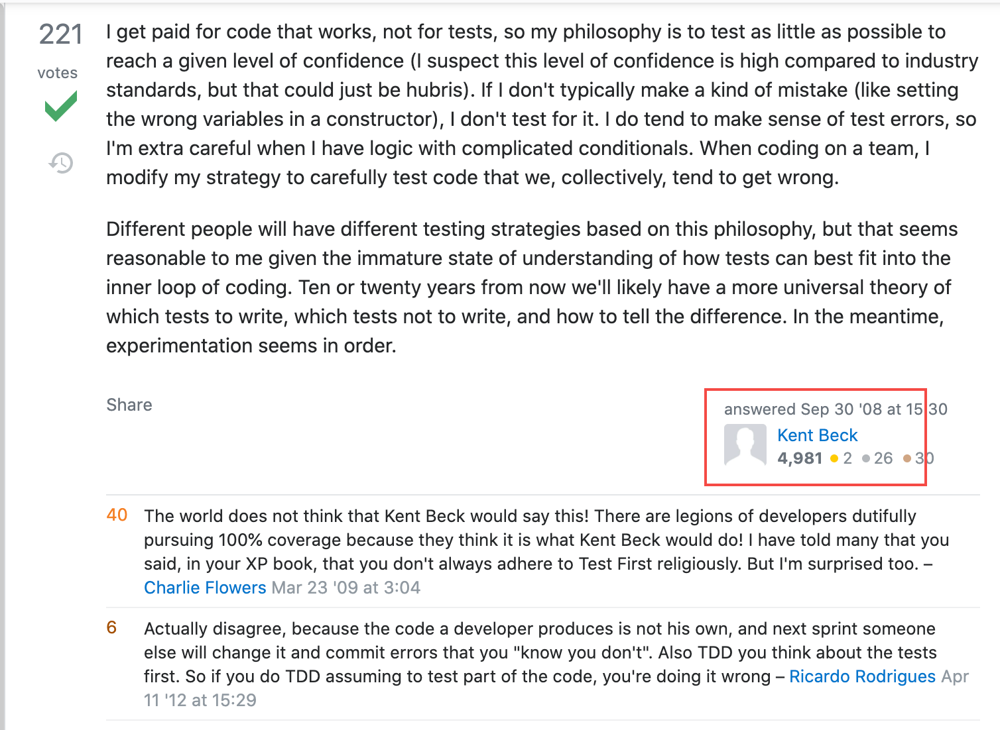

# 单测的一些实践心得

> 谈不上最佳实践，只是自己的一些经验分享，不一定对，欢迎讨论。

## 背景

> 什么是单测，单测有什么用，为什么要写单测这些大家知道，懒得讲不浪费时间。 

**单测一定要以增强自己代码信心为目标，如果这点作用都没有，那这单测不写也罢**。**增强自己代码信心：** 有了这个单测，覆盖的代码逻辑不用担心在生产环境出问题； 该部分代码重构后， 可以通过单测立即验证。

概念什么的都跳过不谈，直接谈大家关心的问题。 

- 选一个好用的mock框架
- 单测到底切割到什么粒度合适
- 怎么mock成本比较低又能测出问题

## mock框架

| 名称 | 评论 |
|-|-|
| [mockito](https://code.byted.org/gopkg/mockito)  | mockito是字节跳动自己的mock框架， 好用么？ 还行，谈不上很好用。我们写代码的时候对其他模块依赖往往是基于interface，不能mock interface，这意味着其他组件还没写实现类就不能mock， 导致该部分代码没法通过mockito先行测试， 不爽。 |
| [gomonkey](https://github.com/agiledragon/gomonkey) | gomonkey是mockito参考的开源实现， 能mock interface,但用起来也不爽。 |
| [gomock](https://github.com/golang/mock) | gomock算是官方mock包么？看用的人蛮多的， 但是用法就很迷，要先运行命令生成mock interface用起来就很不爽，还要往仓库里提新文件，就很迷。 |
| [bouk/monkey](https://github.com/bouk/monkey) | monkey的star很多，文档和接口看上去也挺易用，但是作者在License里明确说明不允许任何人使用。 |
| https://github.com/DATA-DOG/go-sqlmock | 用于mock db的返回结果，有用么？ 对于有些人或许有，但我不喜欢。 dao层代码唯一会担心出问题的地方就是sql写错、返回内容不对或者未命中索引，这个sql mock了dao层也就什么都测不出来了；如果我不担心sql出错， 那我直接mockDB接口就完事了。 而且sql太多，mock起来太累了。 sqlmock对增加dao层代码信心没有帮助。 |

有其他mock工具欢迎补充。这些工具都谈不上好用，最后我选择了mockito，mockito是公司提供的，除了不能mock interface外，其他倒也没问题。

## 单测粒度

测试用例太粗了，很容易退化成最顶层的handlerTest； 测试用例太细了，维护成本又太高， 各个组件交互部分的异常case又容易漏过； 需要每个方法都有一个单测么？ 这些问题会是大家经常纠结的。

前司团队要求A类应用90%覆盖率, 100%通过率; B类应用60%覆盖率，100%通过率；覆盖率只升不降，否则阻塞发布。 初看似乎很美好，单测几乎覆盖每一个接口，对稳定性似乎有很大的帮助。但这么做却带来了如下问题:

- 维护成本很大，每次发布日的时候，发布经理发现单测阻塞发布，一堆人从早上改到晚上，经常一天下来都不一定能发布，经常错过发布窗口只能等下次；
- 单测有效性不升反降，因为大家为了满足单测覆盖率， 所有东西都mock，很多真正有异常的case都给mock盖掉了。上述例子说明覆盖率并不是越高越好， **但也不是说覆盖率不重要，你的测试用例要是只有10%的覆盖率，哪里来的勇气对自己代码有信心呢，梁静茹给的么**？单测粒度到底做到多细，可以参考这个回答[How deep are your unit tests?](https://stackoverflow.com/questions/153234/how-deep-are-your-unit-tests)



> 大意是Kent Beck说：**老板给我钱是让我写代码，不是做测试的。所以我的原则是测试越少越好，但是要能保证我对自己的代码有信心**。如果我觉得这部分代码不会出错，那我不会在这上面浪费时间写测试。我倾向于测试那些有复杂逻辑容易出错的代码， 这部分的测试越细越好。

[Kent Beck](https://baike.baidu.com/item/Kent%20Beck)是TDD的创始人，junit的创始人之一， 他的这个回答算是震惊世界。 但这也给我们指出了条单测粒度的路: **单测粒度不是越细越好，而是越容易测出问题越好**；所以我们的测试粒度可以是某个我们**担心出问题的一个方法，或者一组方法**(不重构写不出单测系列)；而覆盖率上， 应该是起码要**达到我们对自己的代码有信心**的标准, 一般是覆盖率越高越有信心， 但为了覆盖率降低单测质量是不可取的。

我理解这里Kent Beck所谓的“单测越少越好”，并不是真的建议大家少写单测，而是建立在单测已经能让自己的代码有信心的前提下减少维护成本。 **但是要做到对自己代码有信心，是需要非常多测试用例的。**

## mock粒度

mock到底mock多少， 要mock哪些部分，是否要Mock掉所有的依赖项，这是大家经常会纠结的点。我的经验是这样:

- 不要所有依赖都mock, 如果你把所有东西都mock了，那么一些真正的异常case很容易测不出来(我们之前90%覆盖率的单测就是这样)；
- 如果是自己代码内部的依赖(比如service依赖了某个具体的infra)，如果有具体接口实现的话也尽量不要mock，让测试用例自己去运行，有时候还能顺便测出点自己没想到的异常来;
- 能少mock就少mock，除了上述两个原因以外就是维护成本的考虑，mock费心费力，代码逻辑一旦变更就可能导致原先mock的数据无效，维护起来非常的可怕；这个观点和Ken Beck的尽量少写单测有点像
- **对外部应用的依赖一定要mock**，比如rpc/db/mq等， 这是因为开发环境的外部依赖往往是不稳定的，一旦发生变更就很容易导致单测执行失败， 而且我们的单测也容易导致外部应用产生脏数据；外部依赖不mock也会影响单测的独立性。

## 外部依赖

如果单测换个环境就不能跑，那这不能叫单测,所以单测对远端依赖的部分需要mock掉。

### redis依赖

redis依赖是比较好弄的， 我们可以使用开源库[miniredis](https://github.com/alicebob/miniredis) ， 这是一个专门用于go测试用的redis库。 这比一个个mock redisClient的成本要低非常多。其用法大致如下，跑单测的时候先运行redis, 让需要使用redis的被测对象直接连接该redis。

```Go
mr, err := miniredis.Run()
if err != nil {
   panic(err)
}
mockClient := redis.NewClient(&redis.Options{
   Addr: mr.Addr(),
})

service.RedisClient = mockClient。
```

### DB依赖

DB依赖看到好多人使用了SqlMock， 但是我不喜欢。 DAO层我只会担心并发问题和sql不小心写错，SqlMock完全没法在这两点上给我信心， 如果只是要返回结果，我直接mock DAO层完事了。

看到有些人用了sqlite起个内存DB的做法，是我想要的方式，但总担心sqllite和mysql存在兼容问题导致测试异常， 所以DB依赖上我会倾向于使用一个mysql的内存数据库，比如[dolthub/go-mysql-server](https://github.com/dolthub/go-mysql-server) 。

go-mysql-server这个开源项目，其中的一大使用场景是用于golang的测试环境； 它可以启动一个内存级别的mysql db，初始化一些数据， 可以让被测试对象的db连接指向该内存db。

使用内存db来做测试的好处是: 

1. 没有很夸张的mock成本;
2. 不用担心产生的脏数据问题;
3. 能顺带着测出dao层sql不符合预期的问题。

```Go
func initTestDB() {
    driver := sqle.NewDefault()
    driver.AddDatabase(createTestDatabase())

    config := server.Config{
        Protocol: "tcp",
        Address:  "localhost:3306",
        Auth:     auth.NewNativeSingle("user", "pass", auth.AllPermissions),
    }

    s, err := server.NewDefaultServer(config, driver)
    if err != nil {
        panic(err)
    }

    s.Start()
}

//初始化测试数据
func createTestDatabase() *memory.Database {
    const (
        dbName    = "test"
        tableName = "mytable"
    )

    db := memory.NewDatabase(dbName)
    table := memory.NewTable(tableName, sql.Schema{
        {Name: "name", Type: sql.Text, Nullable: false, Source: tableName},
        {Name: "email", Type: sql.Text, Nullable: false, Source: tableName},
        {Name: "phone_numbers", Type: sql.JSON, Nullable: false, Source: tableName},
        {Name: "created_at", Type: sql.Timestamp, Nullable: false, Source: tableName},
    })

    db.AddTable(tableName, table)
    ctx := sql.NewEmptyContext()

    rows := []sql.Row{
        sql.NewRow("John Doe", "john@doe.com", []string{"555-555-555"}, time.Now()),
        sql.NewRow("John Doe", "johnalt@doe.com", []string{}, time.Now()),
        sql.NewRow("Jane Doe", "jane@doe.com", []string{}, time.Now()),
        sql.NewRow("Evil Bob", "evilbob@gmail.com", []string{"555-666-555", "666-666-666"}, time.Now()),
        }

    for _, row := range rows {
        table.Insert(ctx, row)
    }

    return db
}
```

### RPC依赖

没什么好说的，老老实实 mockito mock掉方法完事。
